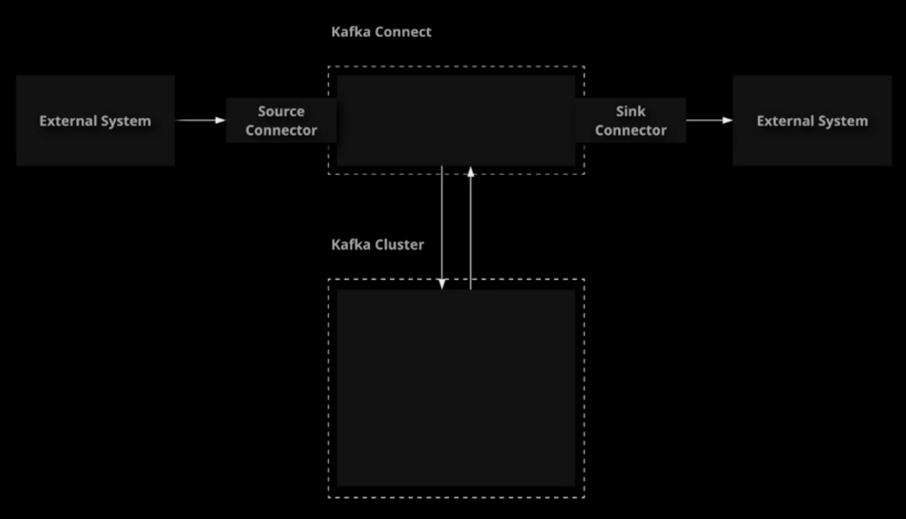

# Kafka Connect

## What Is Kafka Connect?

We have already explored how to get data into and out of Kafka using producers and consumers, but Kafka offers another
method of moving data that is more tailored toward integrations with external systems: Kafka Connect. In this lesson, we will
introduce Kafka Connect, how it works, and its role in the Kafka ecosystem.



- **Kafka Connect**
    Is a tool for streaming data between Kafka and other systems.
- **Source Connectors**
    Import data from external systems into Kafka.
- **Sink Connectors**
    Export data from Kafka into external systems.

These connectors are designed to be scalable and reusable.

Connectors are available for a variety of external systems, and the **Connect API** allows you to build your own.

References:

- [Kafka Connect](https://kafka.apache.org/documentation/#connect)

1. Start and enable the Kafka Connect service on your first broker.

    ```sh
    sudo systemctl start confluent-kafka-connect
    sudo systemctl enable confluent-kafka-connect
    sudo systemctl status confluent-kafka-connect
    ```

## Using Kafka Connect

Kafka Connect provides a useful framework for integrations between Kafka and external systems. In this lesson, we will
examine how to use Kafka Connect. We will demonstrate the process of configuring a simple source and sink connector. This
will give you an idea of what it looks like to use Kafka Connect in practice.

References:

- [Kafka Connect Overview](https://kafka.apache.org/documentation.html#connect)
- [Kafka Connect FileStream Connector Examples](https://docs.confluent.io/platform/current/connect/filestream_connector.html)

1. Create a topic to use for testing.

    ```sh
    kafka-topics \
        --bootstrap-server localhost:9092 \
        --create \
        --topic connect_topic \
        --partitions 1 \
        --replication-factor 1
    ```

1. Create the input and output files.

    ```sh
    cd ~/ \
    && touch input.txt \
    && touch output.txt \
    && chmod 777 output.txt
    ```

1. Enter some data into the input file.

    ```sh
    vi input.txt
    ```

    ```txt
    test data
    test
    data from input.txt
    ```

1. Create a source connector to import data into Kafka from a file.

    ```sh
    curl -X POST http://localhost:8083/connectors \
        -H 'Accept: */*' \
        -H 'Content-Type: application/json' \
        -d '{
            "name": "file_source_connector",
            "config": {
                "connector.class": "org.apache.kafka.connect.file.FileStreamSourceConnector",
                "topic": "connect_topic",
                "file": "/home/cloud_user/input.txt",
                "value.converter": "org.apache.kafka.connect.storage.StringConverter"
            }
        }'
    ```

1. Get information about the source connector.

    ```sh
    curl http://localhost:8083/connectors/file_source_connector \
    && curl http://localhost:8083/connectors/file_source_connector/status
    ```

1. Check the topic to verify the new data has appeared.

    ```sh
    kafka-console-consumer \
        --bootstrap-server localhost:9092 \
        --topic connect_topic \
        --from-beginning
    ```

1. Create a sink connector to export data from Kafka to a file.

    ```sh
    curl -X POST http://localhost:8083/connectors \
        -H 'Accept: */*' \
        -H 'Content-Type: application/json' \
        -d '{
            "name": "file_sink_connector",
            "config": {
                "connector.class": "org.apache.kafka.connect.file.FileStreamSinkConnector",
                "topics": "connect_topic",
                "file": "/home/cloud_user/output.txt",
                "value.converter": "org.apache.kafka.connect.storage.StringConverter"
            }
        }'
    ```

1. Check the contents of the output file.

    ```sh
    cat /home/cloud_user/output.txt
    ```

1. Delete both connectors to clean up.

    ```sh
    curl -X DELETE http://localhost:8083/connectors/file_source_connector
    curl -X DELETE http://localhost:8083/connectors/file_sink_connector
    ```

## [Hands-On] Exporting Data to a File with Kafka Connect

Your supermarket company is using Kafka to manage some data. They want to export data from a topic to a data file on the disk for analysis. You have been asked to set up a connector to automatically export records from the `inventory_purchases` topic to a file located at `/home/cloud_user/output/output.txt`.

Use the following information as you implement a solution:

- The connector class `org.apache.kafka.connect.file.FileStreamSinkConnector` can be used to export data to a file.
- Set the number of tasks to `1`.
- The data in the topic is string data, so use `org.apache.kafka.connect.storage.StringConverter` for `key.converter` and `value.converter`.

Here is an example of a connector configuration for a FileStream Sink Connector:

```json
"connector.class": "org.apache.kafka.connect.file.FileStreamSinkConnector",
"tasks.max": "1",
"file": "<file path>",
"topics": "<topic>",
"key.converter": "<key converter>",
"value.converter": "<value converter>"
```

Once you have set up the connector, publish a new record to the topic for a purchase of plums:

```sh
kafka-console-producer \
    --broker-list localhost:9092 \
    --topic inventory_purchases
```

```txt
plums:5
```

Check the file to verify that the new record appears:

```sh
cat /home/cloud_user/output/output.txt
```

If you get stuck, feel free to check out the solution video, or the detailed instructions under each objective. Good luck!

### Create a Connector to Export Data from the `inventory_purchases` Topic to a File

1. Create a `FileStreamSinkConnector`:

    ```sh
    curl -X POST \
        http://localhost:8083/connectors \
        -H "Content-Type: application/json" \
        -d '{
            "name": "file_sink",
            "config": {
                "connector.class": "org.apache.kafka.connect.file.FileStreamSinkConnector",
                "tasks.max": "1",
                "file": "/home/cloud_user/output/output.txt",
                "topics": "inventory_purchases",
                "key.converter": "org.apache.kafka.connect.storage.StringConverter",
                "value.converter": "org.apache.kafka.connect.storage.StringConverter"
            }
        }'
    ```

1. We should see data from the topic appearing in the output file:

    ```sh
    cat /home/cloud_user/output/output.txt
    ```

### Publish a New Purchase of Plums to the `inventory_purchases` Topic

1. Start up a console producer:

    ```sh
    kafka-console-producer \
        --broker-list localhost:9092 \
        --topic inventory_purchases
    ```

1. Publish some data representing a purchase of plums:

    ```txt
    plums:5
    ```

1. Close the producer with the keyboard shortcut (e.g. `Ctrl + C`).
1. Check the file and verify that the purchase of plums shows up in the file data:

    ```sh
    cat /home/cloud_user/output/output.txt
    ```

    > Note: It may take a few moments for the connector to process the new data.

## [Hands-On] Importing Data from a Database with Kafka Connect

Your supermarket company is using Kafka to manage some of its data. They have a PostgreSQL database that
contains some important data, but they want to use Kafka to perform stream processing on this data.
You have been asked to implement a Connector to load this data from the database into Kafka.
Configure this connector so that new records will be automatically loaded into Kafka as they are created in the database.

Use the following information as you implement a solution:

- The database name on the PostgreSQL server is `inventory`.
- A database user has been set up which you can use to connect. The credentials are username `kafka` and password `Kafka`!.
- Use a topic prefix of `postgres-` so that the topics created by the connector will be identifiable as coming from the PostgreSQL database.
- The database can be reached at the IP address `10.0.1.102` on port `5432`. You can use a JDBC string like this to connect to the database: `jdbc:postgresql://10.0.1.102:5432/<database name>`.
- The connector class `io.confluent.connect.jdbc.JdbcSourceConnector` can be used to pull data from databases using JDBC.
Here is an example of a connector configuration for a JDBC Source Connector:

```json
"connector.class": "io.confluent.connect.jdbc.JdbcSourceConnector",
"connection.url": "jdbc:postgresql://10.0.1.102:5432/<database name>",
"connection.user": "<database user>",
"connection.password": "<database password>",
"topic.prefix": "postgres-",
"mode":"timestamp",
"timestamp.column.name": "update_ts"
```

Once you have set up the connector, log in to the database server and insert a new record for a purchase of
`plums` into the `purchases` table within the `inventory` database. Afterward, verify that the new record is
automatically ingested into the Kafka topic by the connector. You can insert a new record like so:

```sh
sudo -i -u postgres
psql
\c inventory;
```

```sql
INSERT INTO purchases (product, quantity, purchase_time, update_ts)
VALUES ('plums', 8, current_timestamp, current_timestamp);
```

You can check your topic like so verify the data that is being ingested:

```sh
kafka-console-consumer \
    --bootstrap-server localhost:9092 \
    --topic postgres-purchases \
    --from-beginning
```

After inserting the new record in the database, it should automatically appear in the topic.

If you get stuck, feel free to check out the solution video, or the detailed instructions under each objective. Good luck!

### Create a Connector to Load Data from the Database into Kafka

1. Create a JDBC connector to load data from the PostgreSQL database.

    ```sh
    curl -X POST \
        http://localhost:8083/connectors \
        -H "Content-Type: application/json" \
        -d '{
            "name": "jdbc_source_postgres",
            "config": {
                "connector.class": "io.confluent.connect.jdbc.JdbcSourceConnector",
                "connection.url": "jdbc:postgresql://10.0.1.102:5432/inventory",
                "connection.user": "kafka",
                "connection.password": "Kafka!",
                "topic.prefix": "postgres-",
                "mode":"timestamp",
                "timestamp.column.name": "update_ts"
            }
        }'
    ```

1. List the topic. We should see a new topic called `postgres-purchases`.

    ```sh
    kafka-topics \
        --bootstrap-server localhost:9092 \
        --list
    ```

1. Start a console consumer to read from the `postgres-purchases` topic:

    ```sh
    kafka-console-consumer \
        --bootstrap-server localhost:9092 \
        --topic postgres-purchases \
        --from-beginning
    ```

    > Note: We should see a series of records loaded from the database. Leave the consumer running so we can observe what happens when inserting a new record into the PostgreSQL table.

### Insert a New Record for a Purchase of Plums and Observe What Happens to the Topic as a Result

1. Log in to the PostgreSQL database server.
1. Change to the `postgres` user and connect to the `inventory` database:

    ```sh
    sudo -i -u postgres

    psql

    \c inventory;

    ```

1. Insert a new record into the purchases table:

    ```sql
    INSERT INTO purchases (product, quantity, purchase_time, update_ts)
    VALUES ('plums', 8, current_timestamp, current_timestamp);
    ```

    > Note: If we leave the console consumer running, we should see a new record appear in the postgres-purchases topic containing the data we just inserted.
