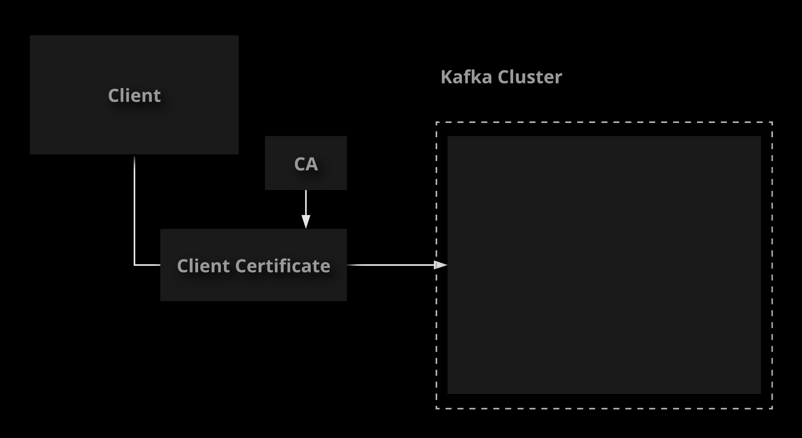
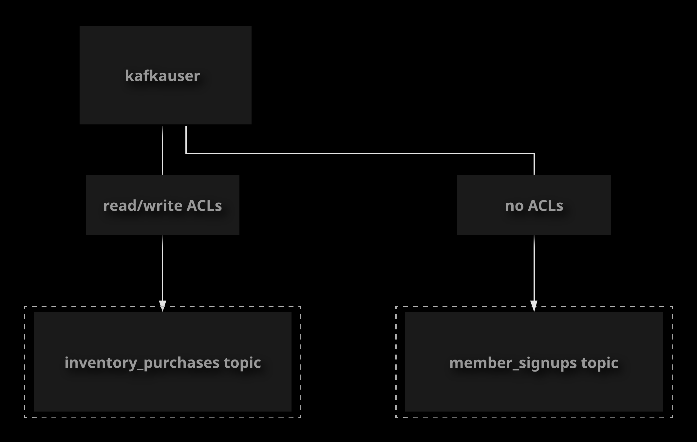

# Kafka Security

## TLS Encryption

Kafka provides a variety of security features to help you secure your cluster. In this lesson, we will discuss Transport Layer
Security (TLS) encryption. We will demonstrate how to secure your cluster with TLS certificates as well as how to connect to a
TLS-secured port as a client.

If you plan to have external clients (such as producers and consumers) connect to Kafka, it may be a good idea
to confirm that they use **TLS** to do so.

**Transport Layer Security (TLS)** prevents main-in-the-middle (MITM) attacts, plu ensures that communication
between clients and Kafka servers is encrypted.

To set up TLS, we will need to:

- Create a certificate authority.
- Create signed certificates for our Kafka brokers.
- Configure brokers to enable TLS and use the certificates.
- Configure a client to connect securely and trust the certificates.

References:

- [Encryption and Authentication Using SSL](https://kafka.apache.org/documentation.html#security_ssl)

### Create Some Test Data

1. To begin, create a test topic with some data that you can read at the end for testing.

    ```sh
    kafka-topics \
        --bootstrap-server localhost:9092 \
        --create \
        --topic tls-test \
        --partitions 1 \
        --replication-factory 1
    ```

1. Produce some data to the tls-test topic.

    ```sh
    kafka-console-producer \
        --broker-list localhost:9092 \
        --topic tls-test
    ```

### Generate Certificate Files

1. Log in to your first broker. Create a directory to work in as you generate certificate files.

    ```sh
    cd ~/
    mkdir certs
    cd certs
    ```

1. Generate a certificate authority (CA).

    ```sh
    openssl req -new -x509 -keyout ca-key -out ca-cert -days 365 -subj "/C=US/ST=Texas/L=Keller/O=Linux Academy/OU=Content/CN=CCDAK"
    ```

1. When prompted, enter and verify a new passphrase.
1. Create trust stores for clients and servers, and import the certificate authority public key into both trust stores.

    ```sh
    keytool -keystore client.truststore.jks -alias CARoot -import -file ca-cert
    keytool -keystore server.truststore.jks -alias CARoot -import -file ca-cert
    ```

1. When prompted, create a new keystore password for each trust store, and type `yes` for both to import the CA certificate.
1. Generate keys and certificates for all three brokers using the CA. Note that we are generating all of these certificates on the
first broker. We will copy the necessary files to the other brokers later.

    ```sh
    keytool -keystore zoo1.keystore.jks -alias localhost -validity 365 -genkey -keyalg RSA \
        -dname "CN=<broker 1 hostname>, OU=Unknown, O=Unknown, L=Unknown, ST=Unknown, C=Unknown" \
        -ext "san=dns:zoo1,dns:localhost,ip:127.0.0.1,ip:<broker 1 private IP>" \

    && keytool -keystore zoo2.keystore.jks -alias localhost -validity 365 -genkey -keyalg RSA \
        -dname "CN=<broker 2 hostname>, OU=Unknown, O=Unknown, L=Unknown, ST=Unknown, C=Unknown" \
        -ext "san=dns:zoo2,dns:localhost,ip:127.0.0.1,ip:<broker 2 private IP>" \

    && keytool -keystore zoo3.keystore.jks -alias localhost -validity 365 -genkey -keyalg RSA \
        -dname "CN=<broker 3 hostname>, OU=Unknown, O=Unknown, L=Unknown, ST=Unknown, C=Unknown" \
        -ext "san=dns:zoo3,dns:localhost,ip:127.0.0.1,ip:<broker 3 private IP>"
    ```

1. When prompted, create a keystore password for all three keystores. When prompted for the key password, you can simply
press `RETURN` to use the keystore password for the key as well.

1. Export each server's certificate from its keystore.

    ```sh
     keytool -keystore zoo1.keystore.jks -alias localhost -certreq -file zoo1-cert-file
     keytool -keystore zoo2.keystore.jks -alias localhost -certreq -file zoo2-cert-file
     keytool -keystore zoo3.keystore.jks -alias localhost -certreq -file zoo3-cert-file
    ```

1. Create a certificate-signing configuration file to contain the SANs for each broker.

    ```sh
    echo subjectAltName = DNS:zoo1,DNS:localhost,IP:127.0.0.1,IP:<broker 1 private IP> >> zoo1-extfile.cnf \
    && echo subjectAltName = DNS:zoo2,DNS:localhost,IP:127.0.0.1,IP:<broker 2 private IP> >> zoo2-extfile.cnf \
    && echo subjectAltName = DNS:zoo3,DNS:localhost,IP:127.0.0.1,IP:<broker 3 private IP> >> zoo2-extfile.cnf
    ```

1. Sign each broker certificate with the CA.

    ```sh
    openssl x509 -req -CA ca-cert -CAkey ca-key \
        -in zoo1-cert-file \
        -out zoo1-cert-signed \
        -days 365 -CAcreateserial \
        -extfile zoo1-extfile.cnf \
    && openssl x509 -req -CA ca-cert -CAkey ca-key \
        -in zoo2-cert-file \
        -out zoo2-cert-signed \
        -days 365 -CAcreateserial \
        -extfile zoo2-extfile.cnf \
    && openssl x509 -req -CA ca-cert -CAkey ca-key \
        -in zoo3-cert-file \
        -out zoo3-cert-signed \
        -days 365 -CAcreateserial \
        -extfile zoo3-extfile.cnf
    ```

1. Import the CA certificate and signed broker certificate into each server's keystore.

    ```sh
    keytool -keystore zoo1.keystore.jks -alias CARoot -import -file ca-cert \
    && keytool -keystore zoo1.keystore.jks -alias localhost -import -file zoo1-cert-signed \
    && keytool -keystore zoo2.keystore.jks -alias CARoot -import -file ca-cert \
    && keytool -keystore zoo2.keystore.jks -alias localhost -import -file zoo2-cert-signed \
    && keytool -keystore zoo3.keystore.jks -alias CARoot -import -file ca-cert \
    && keytool -keystore zoo3.keystore.jks -alias localhost -import -file zoo3-cert-signed
    ```

### Configure Your Brokers

1. Copy the appropriate keystore to the `cloud_user` home directory on each server.

    ```sh
    cp zoo1.keystore.jks server.truststore.jks /home/cloud_user/ \
    && scp zoo2.keystore.jks server.truststore.jks cloud_user@zoo2:/home/cloud_user \
    && scp zoo3.keystore.jks server.truststore.jks cloud_user@zoo3:/home/cloud_user
    ```

1. On all three brokers, create a directory to hold the keystore and trust store.

    ```sh
    cd ~/ \
    && sudo mkdir -p /var/private/ssl \
    && sudo mv server.truststore.jks /var/private/ssl/ \
    && sudo mv zoo<1, 2, or 3>.keystore.jks /var/private/ssl/server.keystore.jks \
    && sudo chown -R root:root /var/private/ssl/
    ```

1. On each broker, configure SSL in `server.properties`.

    ```sh
    sudo vi /etc/kafka/server.properties
    ```

1. Add the following line to the file (there is a commented version of this line that you can uncomment and edit if you desire).

    ```sh
    listeners=PLAINTEXT://zoo<1, 2, or 3>:9092,SSL://zoo<1, 2, or 3>:9093
    ```

1. Find the line for `advertised.listeners`, and delete it or comment it out.

    ```sh
    #advertised.listeners=PLAINTEXT://zoo<1, 2, or 3>:9092
    ```

1. Add the following lines. Enter the password values you used when generating the certificates and stores.

    ```sh
    ssl.keystore.location=/var/private/ssl/server.keystore.jks
    ssl.keystore.password=<keystore password>
    ssl.key.password=<broker key password>
    ssl.truststore.location=/var/private/ssl/server.truststore.jks
    ssl.truststore.password=<trust store password>
    ssl.client.auth=none
    ```

1. Restart Kafka on all three brokers.

    ```sh
    sudo systemctl restart confluent-kafka
    ```

1. Wait a few moments, then check the status of the Kafka service.

    ```sh
    sudo systemctl status confluent-kafka
    ```

### Use SSL to Connect as a Client

1. On broker 1, copy the client trust store to an appropriate location.

    ```sh
    sudo cp ~/certs/client.truststore.jks /var/private/ssl/
    sudo chown root:root /var/private/ssl/client.truststore.jks
    ```

1. Connect to the cluster's non-secure port using a command line client.

    ```sh
    kafka-console-consumer \
        --bootstrap-server zoo1:9092 \
        --topic tls-test \
        --from-beginning
    ```

1. Create a configuration file so you can easily use the SSL port with clients.

    ```sh
    cd ~/
    vi client-ssl.properties
    ```

    ```sh
    security.protocol=SSL
    ssl.truststore.location=/var/private/ssl/client.truststore.jks
    ssl.truststore.password=<client trust store password>
    ```

1. Connect to the cluster's secure port using a command line client.

    ```sh
    kafka-console-consumer \
        --bootstrap-server zoo1:9093 \
        --topic tls-test \
        --from-beginning \
        --consumer.config client-ssl.properties
    ```

## Client Authentication

For additional security, you may want to use client authentication. There are multiple ways to authenticate
with Kafka. Check the documentation for a full list.

One way to authenticate is to use **mutual TLS** with client certificates. To set this up, we can:

- Geneate a client certificate.
- Sign it with the Certificate Authority.
- Enable SSL client authentication on the brokers.
- Configure a client to use the client certificate.

To implement a Kafka ecosystem securely, it may be necessary to use client authentication to ensure that only properly
authenticated clients can interact with the cluster. In this lesson, we will discuss client authentication. We will also demonstrate
how to set up client authentication using client certificates.

References:

- [Encryption and Authentication Using SSL](https://kafka.apache.org/documentation.html#security_ssl)

1. Generate and sign a client certificate using the CA.

    ```sh
    cd ~/certs \
    && keytool -keystore client.keystore.jks -alias kafkauser -validity 365 -genkey -keyalg RSA \
        -dname "CN=kafkauser, OU=Unknown, O=Unknown, L=Unknown, ST=Unknown, C=Unknown" \
    && keytool -keystore client.keystore.jks -alias kafkauser -certreq -file client-cert-file \
    && openssl x509 -req -CA ca-cert -CAkey ca-key -in client-cert-file -out client-cert-signed -days 365 -CAcreateserial \
    && keytool -keystore client.keystore.jks -alias CARoot -import -file ca-cert \
    && keytool -keystore client.keystore.jks -alias kafkauser -import -file client-cert-signed
    ```

1. Move the client keystore to an appropriate location.

    ```sh
    sudo cp client.keystore.jks /var/private/ssl/ \
    && sudo chown root:root /var/private/ssl/client.keystore.jks
    ```

1. On all three brokers, edit `server.properties` to enable and require client authentication.

    ```sh
    sudo vi /etc/kafka/server.properties
    ```

1. Edit the `ssl.client.auth` line

    ```sh
    ssl.client.auth=required
    ```

1. Restart Kafka, and check its status.

    ```sh
    sudo systemctl restart confluent-kafka \
    && sudo systemctl status confluent-kafka
    ```

1. Attempt to connect a client to the secure port. This should fail, since the client is not yet configured to use its client
certificate.

    ```sh
    kafka-console-consumer \
        --bootstrap-server zoo1:9093 \
        --topic tls-test \
        --from-beginning \
        --consumer.config client-ssl.properties
    ```

1. Edit your client configuration file.

    ```sh
    cd ~/ \
    && vi client-ssl.properties
    ```

1. Configure client authentication with a client certificate.

    ```sh
    ssl.keystore.location=/var/private/ssl/client.keystore.jks
    ssl.keystore.password=<client keystore password>
    ssl.key.password=<client key password>
    ```

1. Connect with the client again, this time using the client certificate. You should be able to read from the topic successfully.

    ```sh
    kafka-console-consumer \
        --bootstrap-server zoo1:9093 \
        --topic tls-test \
        --from-beginning \
        --consumer.config client-ssl.properties
    ```

## ACL Authorization

Once you have the ability to authenticate clients, you may consifer exercising more granular control over what
each client can do in you cluster.

Kafka uses **Access Control Lists (ACLs)** taht let you control what users can do. You can allow or disallow
granular operations such as **reading** and **writing**, plus do so against a variety of resources like **topics**,
**cluster configurations**, etc.

An ACL contains the following components:

- Principal - This is the user.
- Allow/Deny
- Operation - What the user can do, for example, read or write.
- Host - The IP address(es) of hosts connecting to the cluster to perform this action.
- Resource Parttern - A pattern that matches one or more resources, such as a topics.

You can manage ACLs using the `kafka-acls` command line tool.

References:

- [Authorization and ACLs](https://kafka.apache.org/documentation/#security_authz)

Once you are able to authenticate Kafka clients, you may want to exercise granular control over the operations individual users
are allowed to perform. You can control access with ACLs. In this lesson, we will talk about ACLs. We will demonstrate how to
enable and configure ACL authorization in the cluster, and we will walk through the process of creating ACLs in order to control
user access.

1. Create a test topic.

    ```sh
    kafka-topics \
        --bootstrap-server zoo1:9092 \
        --create \
        --topic acl-test \
        --partitions 1 \
        --replication-factor 1
    ```

1. On all three brokers, enable ACL authorization in `server.properties`

    ```sh
    sudo vi /etc/kafka/server.properties
    ```

1. Add the following lines.

    ```conf
    authorizer.class.name=kafka.security.auth.SimpleAclAuthorizer
    super.users=User:admin
    allow.everyone.if.no.acl.found=true
    ssl.principal.mapping.rules=RULE:^CN=(.*?),OU=.*$/$1/,DEFAULT
    ```

1. Restart Kafka, and check its status

    ```sh
    sudo systemctl restart confluent-kafka \
    && sudo systemctl status confluent-kafka
    ```

1. Write some data to the topic. This should work since the topic has no ACLs and `allow.everyone.if.no.acl.found` is set
to `true`.

    ```sh
    kafka-console-producer \
        --broker-list zoo1:9093 \
        --topic acl-test \
        --producer.config client-ssl.properties
    ```

1. Add an ACL to allow `otheruser` to write to the topic

    ```sh
    kafka-acls \
        --authorizer-properties zookeeper.connect=localhost:2181 \
        --add \
        --allow-principal User:otheruse \
        --operation all \
        --topic acl-test
    ```

    > Note: It will give full permission to the `otheruser` for `acl-test` topic

1. Attempt to write to the topic again. This time it should fail, since the topic has an ACL but not one that allows `kafkauser`
to write to it.

    ```sh
    kafka-console-producer \
        --broker-list zoo1:9093 \
        --topic acl-test \
        --producer.config client-ssl.properties
    ```

1. Create an ACL allowing `kafkauser` to write to the `acl-test` topic.

    ```sh
    kafka-acls \
        --authorizer-properties zookeeper.connect=localhost:2181 \
        --add \
        --allow-principal User:kafkauser \
        --operation write \
        --topic acl-test
    ```

1. Attempt to write to the topic once more. This time it should succeed

    ```sh
    kafka-console-producer \
        --broker-list zoo1:9093 \
        --topic acl-test \
        --producer.config client-ssl.properties
    ```

## [Hands-On] Using Client Authentication with Kafka



Your supermarket company is using Kafka as part of its backend data infrastructure. The cluster has already
been secured with TLS on a secure port, but currently, any client using that secure port has full access to
everything in the cluster.

You have been asked to implement client authentication using client certificates. The purpose of this task
is so that only clients with client certificates signed by the cluster's certificate authority can use the secure port.

To complete this task, you will need the following information:

- The certificate authority files you need in order to sign the client certificate (`ca-cert` and `ca-key`) can be found in `/home/cloud_user/certs`.
- The password for the ca-key is `AllTheKeys`.
- There is a client configuration file located at `/home/cloud_user/client-ssl.properties`.
- There is a topic called `inventory_purchases` with a few test records. You can consume from this topic in order to test your configuration like so:

    ```sh
    kafka-console-consumer \
        --bootstrap-server zoo1:9093 \
        --topic inventory_purchases \
        --from-beginning \
        --consumer.config client-ssl.properties
    ```

If you get stuck, feel free to check out the solution video, or the detailed instructions under each objective.
Good luck!

### Generate Your Client Certificate Files

1. Generate a client certificate. Choose a password for the client keystore when prompted:

    ```sh
    cd ~/certs/ \
    && keytool -keystore client.keystore.jks -alias kafkauser -validity 365 -genkey -keyalg RSA \
        -dname "CN=kafkauser, OU=Unknown, O=Unknown, L=Unknown, ST=Unknown, C=Unknown"
    ```

1. When prompted, enter the `keystore password` that was set.
1. When prompted, re-enter the `keystore password`.
1. When prompted with `RETURN if same as keystore password`, just hit enter again to make it the same password as the keystore.
1. Sign the key:

    ```sh
    keytool -keystore client.keystore.jks -alias kafkauser -certreq -file client-cert-file
    ```

1. When prompted, enter the `keystore password`.
1. Sign the certificate:

    ```sh
    openssl x509 -req -CA ca-cert -CAkey ca-key -in client-cert-file -out client-cert-signed -days 365 -CAcreateserial
    ```

1. When prompted for the `ca-key` passphrase, use  `AllTheKeys`.
1. Import the public certificate:

    ```sh
    keytool -keystore client.keystore.jks -alias CARoot -import -file ca-cert
    ```

1. When prompted, enter the `keystore password`.
1. Type `yes` to accept the certificate.
1. Import the signed certificate:

    ```sh
    keytool -keystore client.keystore.jks -alias kafkauser -import -file client-cert-signed
    ```

1. When prompted, enter the `keystore password`.
1. Move the client keystore into an appropriate location:

    ```sh
    sudo cp client.keystore.jks /var/private/ssl/
    ```

1. When prompted, enter the `cloud_user` password.
1. Ensure that the file is owned by `root` with:

    ```sh
    sudo chown root:root /var/private/ssl/client.keystore.jks
    ```

### Enable Client Authentication for the Broker

1. Set client authentication to `required` in `server.properties`:

    ```sh
    sudo vi /etc/kafka/server.properties
    ```

1. Locate the line that begins with `ssl.client.auth` and change it:

    ```sh
    ssl.client.auth=required
    ```

1. Save the changes to the file.
1. Restart Kafka and then verify that everything is working:

    ```sh
    sudo systemctl restart confluent-kafka \
    && sudo systemctl status confluent-kafka
    ```

### Add Client Authentication Settings to Your Client Config File

1. Edit `client-ssl.properties`:

    ```sh
    cd ~/ \
    && vi client-ssl.properties
    ```

1. Add the following lines:

    ```sh
    ssl.keystore.location=/var/private/ssl/client.keystore.jks
    ssl.keystore.password=<your client keystore password>
    ssl.key.password=<your client key password>
    ```

1. Create a console consumer using client authentication to make verify that everything is working:

    ```sh
    kafka-console-consumer \
        --bootstrap-server zoo1:9093 \
        --topic inventory_purchases \
        --from-beginning \
        --consumer.config client-ssl.properties
    ```

## [Hands-On] Kafka Authorization Using ACLs



Your supermarket company is using client authentication and ACLs in order to manage access to a Kafka cluster.
They have ACLs configured for some existing topics but due to new requirements, some changes need to be made
in order to allow access for a new client user called `kafkauser`. Note that `allow.everyone.if.no.acl.found` is
set to `true` for this cluster.

Implement the following authorization changes to the cluster:

- Provide `kafkauser` with read and write access to the `inventory_purchases` topic
- Remove all existing ACLs for the `member_signups` topic to allow access to all users, including `kafkauser`

There is a client configuration file on the server located at `/home/cloud_user/client-ssl.properties`. This configuration will allow you to authenticate as `kafkauser`.

If you get stuck, feel free to check out the solution video, or the detailed instructions under each objective.
Good luck!

### Add an ACL to Give kafkauser Read and Write Access to the inventory_purchases Topic

1. Create the ACL.

    ```sh
    kafka-acls \
        --authorizer-properties zookeeper.connect=localhost:2181 \
        --add \
        --allow-principal User:kafkauser \
        --operation read \
        --operation write \
        --topic inventory_purchases
    ```

    ```txt
    Adding ACLs for resource `Topic:LITERAL:inventory_purchases`:
        User:kafkauser has Allow permission for operations: Read from hosts: *
        User:kafkauser has Allow permission for operations: Write from hosts: *

    Current ACLs for resource `Topic:LITERAL:inventory_purchases`:
            User:dataadmin has Allow permission for operations: All from hosts: *
            User:kafkauser has Allow permission for operations: Read from hosts: *
            User:kafkauser has Allow permission for operations: Write from hosts: *
    ```

1. Verify that the read access works by consuming from the topic.

    ```sh
    kafka-console-consumer \
        --bootstrap-server zoo1:9093 \
        --topic inventory_purchases \
        --from-beginning \
        --consumer.config client-ssl.properties
    ```

    > Note: Data from that topic should be displayed. Pressing **Ctrl+C** will stop the command so that we can continue.

1. Verify that the write access works by writing data to the topic.

    ```sh
    kafka-console-producer \
        --broker-list zoo1:9093 \
        --topic inventory_purchases \
        --producer.config client-ssl.properties
    ```

    > Note: After running this command, provide some sample data such as "test data" or "another test" and press **Enter**. If no errors are displayed, the write was successful. Press **Ctrl+C** to stop the command to continue.

### Remove All Existing ACLs for the member_signups Topic

1. List the ACLs for the topic.

    ```sh
    kafka-acls \
        --authorizer-properties zookeeper.connect=localhost:2181 \
        --topic member_signups \
        --list
    ```

    ```txt
    Current ACLs for resource `Topic:LITERAL:member_signups`:
        User:dataadmin has Allow permission for operations: All from hosts: *
    ```

1. Remove the existing ACL for the topic.

    ```sh
    kafka-acls \
        --authorizer-properties zookeeper.connect=localhost:2181 \
        --topic member_signups \
        --remove
    ```

    > Note: At the prompt, enter **y** to confirm the removal.

1. Verify that you can read from the topic as `kafkauser`.

    ```sh
    kafka-console-consumer \
        --bootstrap-server zoo1:9093 \
        --topic member_signups \
        --from-beginning \
        --consumer.config client-ssl.properties
    ```

    > Note: Data from the topic should be displayed.
