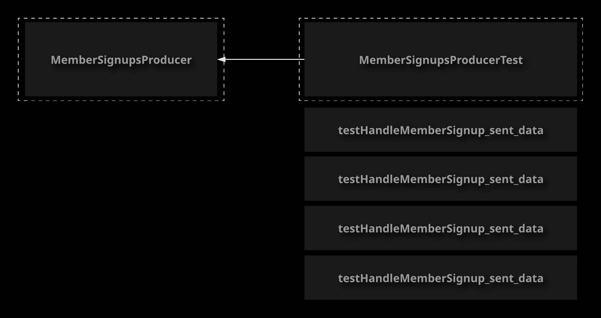
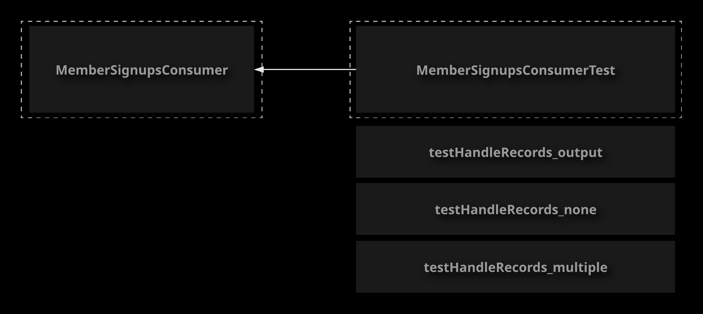
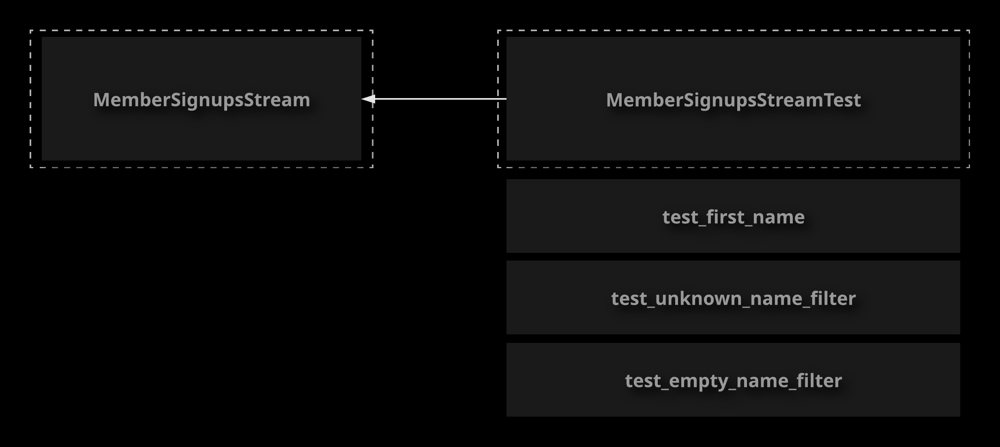

# Testing

## Testing Producers

Kafka's APIs make it easy to write your own custom producers to interact with Kafka. However, like any code, it is usually a
good idea to build automated tests for your custom producer code. Luckily, the Kafka Producer API comes with a built-in test
fixture known as MockProducer , which you can use to simulate interactions with the Kafka API in your tests. In this lesson, we
will discuss and demonstrate how to use MockProducer to build unit tests for a custom Kafka producer

**Unit Testing**
Testing a priece of code in isolation. Usually, unit testing is performed by writing code that is designed
to execute the code being tested and verify whether its outputs are correct.

If yo want to write tests for your producer code, you will need to simulate the behavior of the producer
itself in order to see how your code responds.

Luckily, the Producer API includes a class called `MockProducer` to help you accomplish this.

References:

- [Mock Producer](https://kafka.apache.org/20/javadoc/org/apache/kafka/clients/producer/MockProducer.html)

1. Clone the starter project.

    ```sh
    cd ~/
    git clone https://github.com/linuxacademy/content-ccdak-testing
    ```

1. Take a look at the producer class that you will be testing.

    ```sh
    cd ~/content-ccdak-testing
    cat src/main/java/com/linuxacademy/ccdak/testing/MyProducer.java
    ```

1. Edit the test class for `MyProducer`.

    ```sh
    vi src/test/java/com/linuxacademy/ccdak/testing/MyProducerTest.java
    ```

1. Implement a unit test.

    ```java
    package com.linuxacademy.ccdak.testing;

    import java.io.ByteArrayOutputStream;
    import java.io.PrintStream;
    import java.util.List;
    import org.apache.kafka.clients.producer.MockProducer;
    import org.apache.kafka.clients.producer.ProducerRecord;
    import org.apache.kafka.common.serialization.IntegerSerializer;
    import org.apache.kafka.common.serialization.StringSerializer;
    import org.junit.After;
    import org.junit.Assert;
    import org.junit.Before;
    import org.junit.Test;

    /**
    *
    * @author will
    */
    public class MyProducerTest {

        MockProducer<Integer, String> mockProducer;
        MyProducer myProducer;

        // Contains data sent so System.out during the test.
        private ByteArrayOutputStream systemOutContent;
        // Contains data sent so System.err during the test.
        private ByteArrayOutputStream systemErrContent;
        private final PrintStream originalSystemOut = System.out;
        private final PrintStream originalSystemErr = System.err;

        @Before
        public void setUp() {
            mockProducer = new MockProducer<>(false, new IntegerSerializer(), new StringSerializer());
            myProducer = new MyProducer();
            myProducer.producer = mockProducer;
        }

        @Before
        public void setUpStreams() {
            systemOutContent = new ByteArrayOutputStream();
            systemErrContent = new ByteArrayOutputStream();
            System.setOut(new PrintStream(systemOutContent));
            System.setErr(new PrintStream(systemErrContent));
        }

        @After
        public void restoreStreams() {
            System.setOut(originalSystemOut);
            System.setErr(originalSystemErr);
        }

        @Test
        public void testPublishRecord_sent_data() {
            // Perform a simple test to verify that the producer sends the correct data to the correct topic when publishRecord is called.
            myProducer.publishRecord(1, "Test Data");

            mockProducer.completeNext();

            List<ProducerRecord<Integer, String>> records = mockProducer.history();
            Assert.assertEquals(1, records.size());
            ProducerRecord<Integer, String> record = records.get(0);
            Assert.assertEquals(Integer.valueOf(1), record.key());
            Assert.assertEquals("Test Data", record.value());
            Assert.assertEquals("test_topic", record.topic());
            Assert.assertEquals("key=1, value=Test Data\n", systemOutContent.toString());
        }

    }
    ```

1. Execute your unit test to verify that it passes.

    ```sh
    ./gradlew test
    ```

## Testing Consumers

Testing your Kafka consumer code can present some challenges. Kafka's MockConsumer can simplify this process by
providing a way to simulate a real Kafka consumer object, allowing you to test the behavior of your consumer code in isolation.
In this lesson, we will discuss MockConsumer and demonstrate how to use it in a unit test.

Just like with producers, you may want to create unit tests for your Kafka consumers.

You can simulate consumer behavior using the `MockConsumer` mock object.

Like the `MockProduer`, the `MockConsumer` can be injected into your consumer processing code and used to simulate
the behavior of a consumer for testing purposes.

References:

- [MockConsumer](https://kafka.apache.org/20/javadoc/org/apache/kafka/clients/consumer/MockConsumer.html)

1. View the consumer class that you will be testing.

    ```sh
    cd ~/content-ccdak-testing
    cat src/main/java/com/linuxacademy/ccdak/testing/MyConsumer.java
    ```

1. Edit the test class.

    ```sh
    vi src/test/java/com/linuxacademy/ccdak/testing/MyConsumerTest.java
    ```

1. Implement a unit test for the consumer.

    ```java
    package com.linuxacademy.ccdak.testing;

    import java.io.ByteArrayOutputStream;
    import java.io.PrintStream;
    import java.util.Arrays;
    import java.util.HashMap;
    import org.apache.kafka.clients.consumer.ConsumerRecord;
    import org.apache.kafka.clients.consumer.MockConsumer;
    import org.apache.kafka.clients.consumer.OffsetResetStrategy;
    import org.apache.kafka.common.TopicPartition;
    import org.junit.After;
    import org.junit.Assert;
    import org.junit.Before;
    import org.junit.Test;

    /**
    *
    * @author will
    */
    public class MyConsumerTest {

        MockConsumer<Integer, String> mockConsumer;
        MyConsumer myConsumer;

        // Contains data sent so System.out during the test.
        private ByteArrayOutputStream systemOutContent;
        private final PrintStream originalSystemOut = System.out;

        @Before
        public void setUp() {
            mockConsumer = new MockConsumer<>(OffsetResetStrategy.EARLIEST);
            myConsumer = new MyConsumer();
            myConsumer.consumer = mockConsumer;
        }

        @Before
        public void setUpStreams() {
            systemOutContent = new ByteArrayOutputStream();
            System.setOut(new PrintStream(systemOutContent));
        }

        @After
        public void restoreStreams() {
            System.setOut(originalSystemOut);
        }

        @Test
        public void testHandleRecords_output() {
            // Verify that the testHandleRecords writes the correct data to System.out
            String topic = "test_topic";
            ConsumerRecord<Integer, String> record = new ConsumerRecord<>(topic, 0, 1, 2, "Test value");

            mockConsumer.assign(Arrays.asList(new TopicPartition(topic, 0)));
            HashMap<TopicPartition, Long> beginningOffsets = new HashMap<>();
            beginningOffsets.put(new TopicPartition("test_topic", 0), 0L);
            mockConsumer.updateBeginningOffsets(beginningOffsets);

            mockConsumer.addRecord(record);

            myConsumer.handleRecords();
            Assert.assertEquals("key=2, value=Test value, topic=test_topic, partition=0, offset=1\n", systemOutContent.toString());
        }

    }

    ```

1. Execute your test to verify that it passes.

    ```sh
    ./gradlew test
    ```

## Testing Streams Applications

Kafka Streams topologies are a powerful way to process streaming data in real time. Like other forms of code,
it is usually a good idea to build unit tests for them. However, this can be difficult to do, given the
nature of stream processing code. Fortunately, Kafka provides a library of test utilities to simplify the
process of testing Streams topologies. In this lesson, we will discuss the `kafka-streams-test-utils`
library and explore how it can be used to implement unit tests for Kafka Streams applications.

Kafka Streams applications can be more complex than producers and consumers, particularly as they often
involve more asynchronous logic.

Testing Kafka Streams code can be challenging.

Luckily, Kafka provides the `kafka-streams-test-utils` library to make this process significantly easier.

Some of the features offered by `kafka-streams-test-utils` include:

- `TopologyTestDriver`
    Allows you to feed test records in, simulates your topology, and returns output records
- `ConsumeRecordFactory`
    Helps you convert consumer record data into byte arrays that can be processed by the `TopologyTestDriver`
- `OuputVerifier`
    Provides helper methods for verifying output records in your test

References:

- [Testing a Streams Application](https://kafka.apache.org/11/documentation/streams/developer-guide/testing.html)

1. View the Kafka Streams application class that you will be testing.

    ```sh
    cd ~/content-ccdak-testing \
    && cat src/main/java/com/linuxacademy/ccdak/testing/MyStreams.java
    ```

1. Edit the test class.

    ```sh
    vi src/test/java/com/linuxacademy/ccdak/testing/MyStreamsTest.java
    ```

1. Implement the unit test.

    ```java
    package com.linuxacademy.ccdak.testing;

    import java.util.Properties;
    import org.apache.kafka.clients.consumer.ConsumerRecord;
    import org.apache.kafka.clients.producer.ProducerRecord;
    import org.apache.kafka.common.serialization.IntegerDeserializer;
    import org.apache.kafka.common.serialization.IntegerSerializer;
    import org.apache.kafka.common.serialization.Serdes;
    import org.apache.kafka.common.serialization.StringDeserializer;
    import org.apache.kafka.common.serialization.StringSerializer;
    import org.apache.kafka.streams.StreamsConfig;
    import org.apache.kafka.streams.Topology;
    import org.apache.kafka.streams.TopologyTestDriver;
    import org.apache.kafka.streams.test.ConsumerRecordFactory;
    import org.apache.kafka.streams.test.OutputVerifier;
    import org.junit.After;
    import org.junit.Before;
    import org.junit.Test;

    /**
    *
    * @author will
    */
    public class MyStreamsTest {

        MyStreams myStreams;
        TopologyTestDriver testDriver;

        @Before
        public void setUp() {
            myStreams = new MyStreams();
            Topology topology = myStreams.topology;

            Properties props = new Properties();
            props.put(StreamsConfig.APPLICATION_ID_CONFIG, "test");
            props.put(StreamsConfig.BOOTSTRAP_SERVERS_CONFIG, "dummy:1234");
            props.put(StreamsConfig.DEFAULT_KEY_SERDE_CLASS_CONFIG, Serdes.Integer().getClass().getName());
            props.put(StreamsConfig.DEFAULT_VALUE_SERDE_CLASS_CONFIG, Serdes.String().getClass().getName());
            testDriver = new TopologyTestDriver(topology, props);
        }

        @After
        public void tearDown() {
            testDriver.close();
        }

        @Test
        public void test_first_name() {
            // Verify that the stream reverses the record value.
            ConsumerRecordFactory<Integer, String> factory = new ConsumerRecordFactory<>("test_input_topic", new IntegerSerializer(), new StringSerializer());
            ConsumerRecord<byte[], byte[]> record = factory.create("test_input_topic", 1, "reverse");
            testDriver.pipeInput(record);

            ProducerRecord<Integer, String> outputRecord = testDriver.readOutput("test_output_topic", new IntegerDeserializer(), new StringDeserializer());

            OutputVerifier.compareKeyValue(outputRecord, 1, "esrever");
        }

    }

    ```

1. Execute the tests to verify that your new test passes.

    ```sh
    ./gradlew test
    ```

## [Hands-On] Writing Tests for a Kafka Producer



Your supermarket company is using Kafka to manage some of their back-end data infrastructure. They have
created a membership program for customers, and a Kafka producer publishes a message to Kafka every time a
new member signs up for the program.

Unfortunately, the developer who wrote the producer code had to go on sick leave before they could write unit
tests for the code. Your task is to create some unit tests for the producer class.

There is a project in GitHub that contains the code. Clone this project to the Dev server. The producer class
is located at `src/main/java/com/linuxacademy/ccdak/producer/MemberSignupsProducer.java`.
You can find a test class at `src/test/java/com/linuxacademy/ccdak/producer/MemberSignupsProducerTest.java`.
Edit the test class and implement your unit tests there. There are already test methods and some test
fixtures set up in the class.

Luckily, the developer left behind some notes on the unit tests that need to be created.

- `testHandleMemberSignup_sent_data`
    Call the `handleMemberSignup` method and test that the correct data is sent by the producer (both key and value).
- `testHandleMemberSignup_partitioning`
    The producer implements custom partitioning. Records where the value starts with the letters A-M are sent
    to partition 0, and the rest are sent to partition 1. Call `handleMemberSignup` twice - once with a value
    that starts with A-M and once with a value that starts with N-Z. Test that the partitions were set
    appropriately for these records.
- `testHandleMemberSignup_output`
    The producer implements a callback that prints the key and value of the record to `System.out` once the
    record is acknowledged. Test that the correct data is printed to `System.out` by the callback.
    A test fixture has already been set up that will allow you access data printed to `System.out`
    during the test like so: `systemOutContent.toString()`.
- `testHandleMemberSignup_error`
    The producer implements a callback that prints the error message to `System.err` when there is an error.
    Make the producer return an error and test that the correct data is printed to `System.err` by the callback.
    A test fixture has already been set up that will allow you access data printed to `System.err` during the
    test like so: `systemErrContent.toString()`.

If you get stuck, feel free to check out the solution video or the detailed instructions under each objective. Good luck!

### Clone the Starter Project from GitHub and Perform a Test Run

1. Clone the starter project from GitHub (first changing to the home directory if you aren't already in it):

    ```sh
    cd ~/
    git clone https://github.com/linuxacademy/content-ccdak-producer-tests-lab.git
    ```

1. Change to the new content-ccdak-producer-tests-lab directory:

    ```sh
    cd content-ccdak-producer-tests-lab
    ```

1. Perform a test run to make sure the code is able to compile and run:

    ```sh
    ./gradlew test
    ```

The code should compile, but the tests should fail since they are not implemented yet.

### Implement the Unit Tests for the `MemberSignupsProducer`

1. Edit the test class for `MemberSignupsProducer`:

    ```sh
    vi src/test/java/com/linuxacademy/ccdak/producer/MemberSignupsProducerTest.java
    ```

1. Implement the `testHandleMemberSignup_sent_data` test:

    ```java
    @Test
    public void testHandleMemberSignup_sent_data() {
        // Perform a simple test to verify that the producer sends the correct data to the correct topic when handleMemberSignup is called.
        // Verify that the published record has the memberId as the key and the uppercased name as the value.
        // Verify that the records is sent to the member_signups topic.
        memberSignupsProducer.handleMemberSignup(1, "Summers, Buffy");

        mockProducer.completeNext();

        List<ProducerRecord<Integer, String>> records = mockProducer.history();
        Assert.assertEquals(1, records.size());
        ProducerRecord<Integer, String> record = records.get(0);
        Assert.assertEquals(Integer.valueOf(1), record.key());
        Assert.assertEquals("SUMMERS, BUFFY", record.value());
        Assert.assertEquals("member_signups", record.topic());

    }
    ```

1. Implement the `testHandleMemberSignup_partitioning` test:

    ```java
    @Test
    public void testHandleMemberSignup_partitioning() {
        // Verify that records with a value starting with A-M are assigned to partition 0, and that others are assigned to partition 1.
        // You can send two records in this test, one with a value that begins with A-M and the other that begins with N-Z.
        memberSignupsProducer.handleMemberSignup(1, "M");
        memberSignupsProducer.handleMemberSignup(1, "N");

        mockProducer.completeNext();
        mockProducer.completeNext();

        List<ProducerRecord<Integer, String>> records = mockProducer.history();
        Assert.assertEquals(2, records.size());
        ProducerRecord<Integer, String> record1 = records.get(0);
        Assert.assertEquals(Integer.valueOf(0), record1.partition());
        ProducerRecord<Integer, String> record2 = records.get(1);
        Assert.assertEquals(Integer.valueOf(1), record2.partition());
    }
    ```

1. Implement the `testHandleMemberSignup_output` test:

    ```java
    @Test
    public void testHandleMemberSignup_output() {
        // Verify that the producer logs the record data to System.out.
        // A text fixture called systemOutContent has already been set up in this class to capture System.out data.
        memberSignupsProducer.handleMemberSignup(1, "Summers, Buffy");

        mockProducer.completeNext();

        Assert.assertEquals("key=1, value=SUMMERS, BUFFY\n", systemOutContent.toString());
    }
    ```

1. Implement the `testHandleMemberSignup_error` test:

    ```java
    @Test
    public void testHandleMemberSignup_error() {
        // Verify that the producer logs the error message to System.err if an error occurs when seding a record.
        // A text fixture called systemErrContent has already been set up in this class to capture System.err data.
        memberSignupsProducer.handleMemberSignup(1, "Summers, Buffy");

        mockProducer.errorNext(new RuntimeException("test error"));

        Assert.assertEquals("test error\n", systemErrContent.toString());
    }
    ```

1. Save and exit the file.
1. Run your tests and make sure they pass:

    ```sh
    ./gradlew test
    ```

## [Hands-On] Writing Tests for a Kafka Consumer



Your supermarket company has a consumer that consumes messages that are created when customers sign up for a
membership program. This consumer simply logs the messages and their metadata to the console.

The company is reviewing the codebase for compliance with good practices, and this consumer has no unit tests.
Your task is to write some unit tests for the consumer.

There is a [project in GitHub](https://github.com/linuxacademy/content-ccdak-consumer-tests-lab) that contains
the code. Clone this project to the Dev server. The consumer
class is located at `src/main/java/com/linuxacademy/ccdak/consumer/MemberSignupsConsumer.java`. You can find
a test class at `src/test/java/com/linuxacademy/ccdak/consumer/MemberSignupsConsumerTest.java`. Edit the test
class and implement your unit tests there. There are already test methods and some test fixtures set up in the class.

Note the test class contains a test fixture called systemOutContent. You can use this to access data written
to `System.out` during the test like so: `systemOutContent.toString()`

Here are some notes on the tests that need to be created:

- `testHandleRecords_output`
    This test should simply verify the output. Call the `handleRecords` and pass in a record. Test that the
    data is written to `System.out` in the expected format.
- `testHandleRecords_none`
    Test that `handleRecords` works as expected when the collection of records is empty.
- `testHandleRecords_multiple`
    Test that `handleRecords` works as expected when the collection of records contains more than one record.

If you get stuck, feel free to check out the solution video or the detailed instructions under each objective.
Good luck!

### Clone the Starter Project from GitHub and Perform a Test Run

1. Clone the starter project from GitHub (first changing to the home directory if you aren't already in it):

    ```sh
    cd ~/
    git clone https://github.com/linuxacademy/content-ccdak-consumer-tests-lab.git
    ```

1. Change to the new `content-ccdak-consumer-tests-lab` directory:

    ```sh
    cd content-ccdak-consumer-tests-lab
    ```

1. Perform a test run to make sure the code is able to compile and run:

    ```sh
    ./gradlew test
    ```

The code should compile, but the tests should fail since they are not implemented yet.

### Implement the Unit Tests for the `MemberSignupsConsumer`

1. Edit the test class for `MemberSignupsConsumer`:

    ```sh
    vi src/test/java/com/linuxacademy/ccdak/consumer/MemberSignupsConsumerTest.java
    ```

1. Implement the `testHandleRecords_output` test:

    ```java
    @Test
    public void testHandleRecords_output() {
        // Verify that the testHandleRecords writes the correct data to System.out
        // A text fixture called systemOutContent has already been set up in this class to capture System.out data.
        String topic = "member_signups";
        ConsumerRecord<Integer, String> record = new ConsumerRecord<>(topic, 0, 1, 2, "ROSENBERG, WILLOW");
        Map<TopicPartition, List<ConsumerRecord<Integer, String>>> records = new LinkedHashMap<>();
        records.put(new TopicPartition(topic, 0), Arrays.asList(record));
        ConsumerRecords<Integer, String> consumerRecords = new ConsumerRecords<>(records);

        memberSignupsConsumer.handleRecords(consumerRecords);
        Assert.assertEquals("key=2, value=ROSENBERG, WILLOW, topic=member_signups, partition=0, offset=1\n", systemOutContent.toString());
    }
    ```

1. Implement the `testHandleRecords_none` test:

    ```java
    @Test
    public void testHandleRecords_none() {
        // Verify that testHandleRecords behaves correctly when processing no records.
        // A text fixture called systemOutContent has already been set up in this class to capture System.out data.
        String topic = "member_signups";
        Map<TopicPartition, List<ConsumerRecord<Integer, String>>> records = new LinkedHashMap<>();
        records.put(new TopicPartition(topic, 0), Arrays.asList());
        ConsumerRecords<Integer, String> consumerRecords = new ConsumerRecords<>(records);

        memberSignupsConsumer.handleRecords(consumerRecords);
        Assert.assertEquals("", systemOutContent.toString());
    }
    ```

1. Implement the `testHandleRecords_multiple` test:

    ```java
    @Test
    public void testHandleRecords_multiple() {
        // Verify that testHandleRecords behaves correctly when processing multiple records.
        // A text fixture called systemOutContent has already been set up in this class to capture System.out data.
        String topic = "member_signups";
        ConsumerRecord<Integer, String> record1 = new ConsumerRecord<>(topic, 0, 1, 2, "ROSENBERG, WILLOW");
        ConsumerRecord<Integer, String> record2 = new ConsumerRecord<>(topic, 3, 4, 5, "HARRIS, ALEXANDER");
        Map<TopicPartition, List<ConsumerRecord<Integer, String>>> records = new LinkedHashMap<>();
        records.put(new TopicPartition(topic, 0), Arrays.asList(record1, record2));
        ConsumerRecords<Integer, String> consumerRecords = new ConsumerRecords<>(records);

        memberSignupsConsumer.handleRecords(consumerRecords);
        Assert.assertEquals("key=2, value=ROSENBERG, WILLOW, topic=member_signups, partition=0, offset=1\nkey=5, value=HARRIS, ALEXANDER, topic=member_signups, partition=3, offset=4\n", systemOutContent.toString());
    }
    ```

1. Save and exit the file.
1. Run your tests and make sure they pass:

    ```sh
    ./gradlew test
    ```

## [Hands-On] Writing Tests for a Kafka Streams Application



Your supermarket company has a Kafka Streams application that processes messages that are created when
customers sign up for a membership program. The application reads these incoming messages and produces data
to an output topic that is used to send customers an email with information about their new membership account.
This output topic is keyed to the member ID, and the record values are the customer's first name,
formatted properly for the mailing.

The company is reviewing the codebase for compliance with good practices, and this Streams application has
no unit tests. Your task is to write some unit tests for the application.

There is a [project in GitHub](https://github.com/linuxacademy/content-ccdak-streams-tests-lab) that contains
the code. Clone this project to the Dev server. The consumer class is located at
`src/main/java/com/linuxacademy/ccdak/streams/MemberSignupsStream.java`. You can find a
test class at `src/test/java/com/linuxacademy/ccdak/streams/MemberSignupsStreamTest.java`. Edit the test
class and implement your unit tests there. There are already test methods and some test fixtures set up
in the class.

Here are some notes on the features of the application and the tests that need to be created:

- `test_first_name`
    The stream takes records which usually have customer names in the form `LastName, FirstName`.
    The stream parses the value in order to extract only the first name for the mailing. Test this functionality
    by producing a record with a value in the `LastName, FirstName` format and verifying that the output record
    has only the first name as its value.
- `test_unknown_name_filter`
    Some legacy systems are still producing records to the input topic with a value
    of `UNKNOWN` when the customer name is unknown. For now, we won't send these customers an email, so the
    stream filters these records out. Produce a record with a value of `UNKNOWN` and verify that there is no
    corresponding output record.
- `test_empty_name_filter`
    There are also some input systems that produce records to the input topic with
    an empty string as the value when the customer name is unknown. The streams application also filters
    out these records. Produce a record with an empty value and verify that there is no corresponding output record.

If you get stuck, feel free to check out the solution video or the detailed instructions under each objective.
Good luck!

### Clone the Starter Project from GitHub and Perform a Test Run

1. Clone the starter project from GitHub (first changing to the home directory if you aren't already in it):

    ```sh
    cd ~/
    git clone https://github.com/linuxacademy/content-ccdak-streams-tests-lab.git
    ```

1. Change to the new `content-ccdak-streams-tests-lab` directory:

    ```sh
    cd content-ccdak-streams-tests-lab
    ```

1. Perform a test run to make sure the code is able to compile and run:

    ```sh
    ./gradlew test
    ```

    The code should compile, but the tests should fail since they are not implemented yet.

### Implement the Unit Tests for the MemberSignupsStream

1. Edit the test class for MemberSignupsStream:

    ```sh
    vi src/test/java/com/linuxacademy/ccdak/streams/MemberSignupsStreamTest.java
    ```

1. Implement the test_first_name test:

    ```java
    @Test
    public void test_first_name() {
        // Verify that the stream accurately parses the first name from the value.
        ConsumerRecordFactory<Integer, String> factory = new ConsumerRecordFactory<>("member_signups", new IntegerSerializer(), new StringSerializer());
        ConsumerRecord<byte[], byte[]> record = factory.create("member_signups", 1, "Summers, Buffy");
        testDriver.pipeInput(record);

        ProducerRecord<Integer, String> outputRecord = testDriver.readOutput("member_signups_mail", new IntegerDeserializer(), new StringDeserializer());

        OutputVerifier.compareKeyValue(outputRecord, 1, "Buffy");
    }
    ```

1. Implement the test_unknown_name_filter test:

    ```java
    @Test
    public void test_unknown_name_filter() {
        // Verify that the stream filters out records with an empty name value.
        ConsumerRecordFactory<Integer, String> factory = new ConsumerRecordFactory<>("member_signups", new IntegerSerializer(), new StringSerializer());
        ConsumerRecord<byte[], byte[]> record = factory.create("member_signups", 1, "UNKNOWN");
        testDriver.pipeInput(record);

        ProducerRecord<Integer, String> outputRecord = testDriver.readOutput("member_signups_mail", new IntegerDeserializer(), new StringDeserializer());

        Assert.assertNull(outputRecord);
    }
    ```

1. Implement the test_empty_name_filter test:

    ```java
    @Test
    public void test_empty_name_filter() {
        // Verify that the stream filters out records with an empty name value.
        ConsumerRecordFactory<Integer, String> factory = new ConsumerRecordFactory<>("member_signups", new IntegerSerializer(), new StringSerializer());
        ConsumerRecord<byte[], byte[]> record = factory.create("member_signups", 1, "");
        testDriver.pipeInput(record);

        ProducerRecord<Integer, String> outputRecord = testDriver.readOutput("member_signups_mail", new IntegerDeserializer(), new StringDeserializer());

        Assert.assertNull(outputRecord);
    }
    ```

1. Save and exit the file.
1. Run your tests and make sure they pass:

    ```java
    ./gradlew test
    ```
