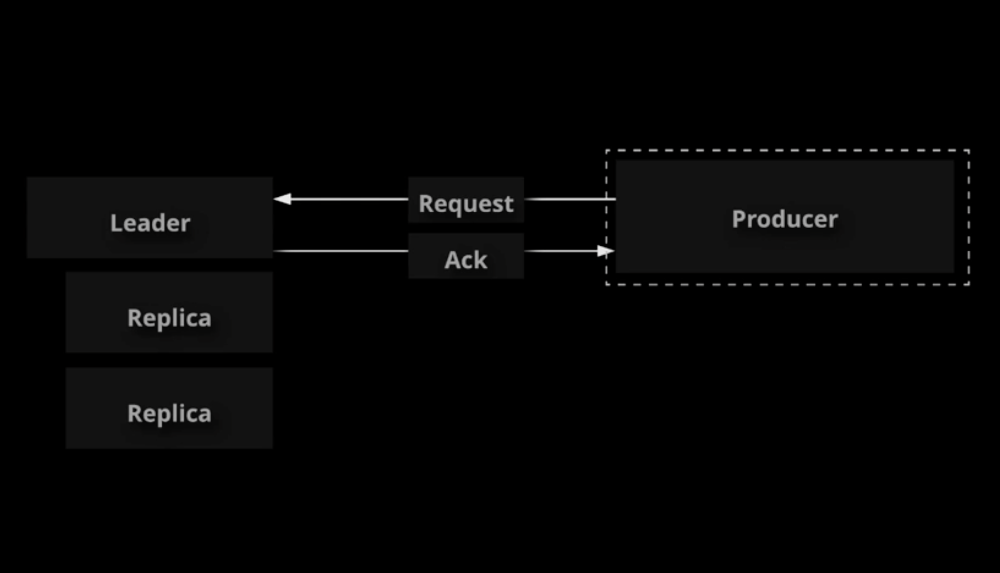
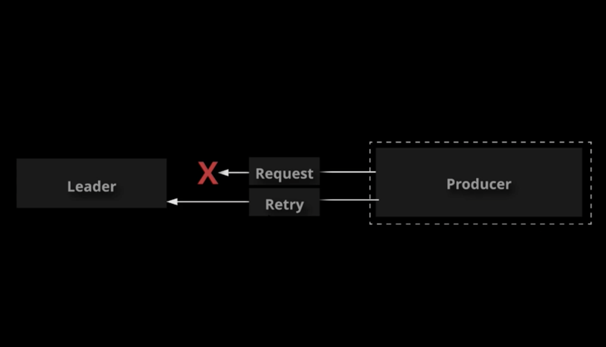
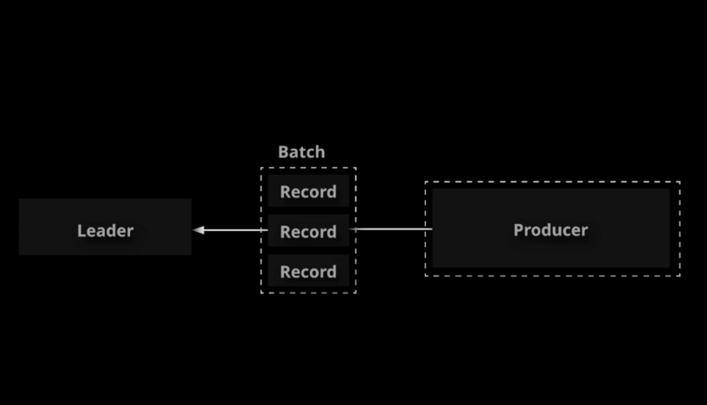
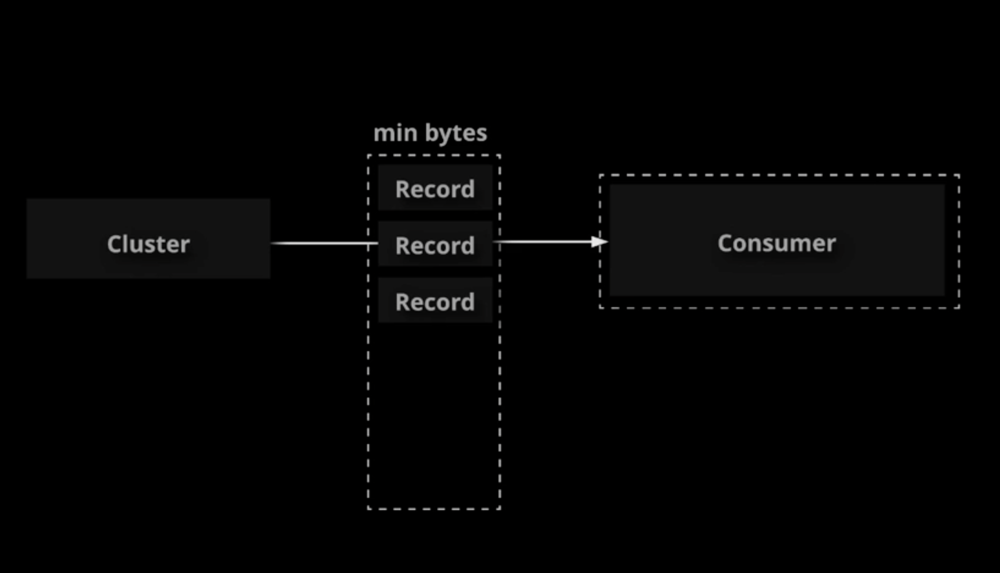
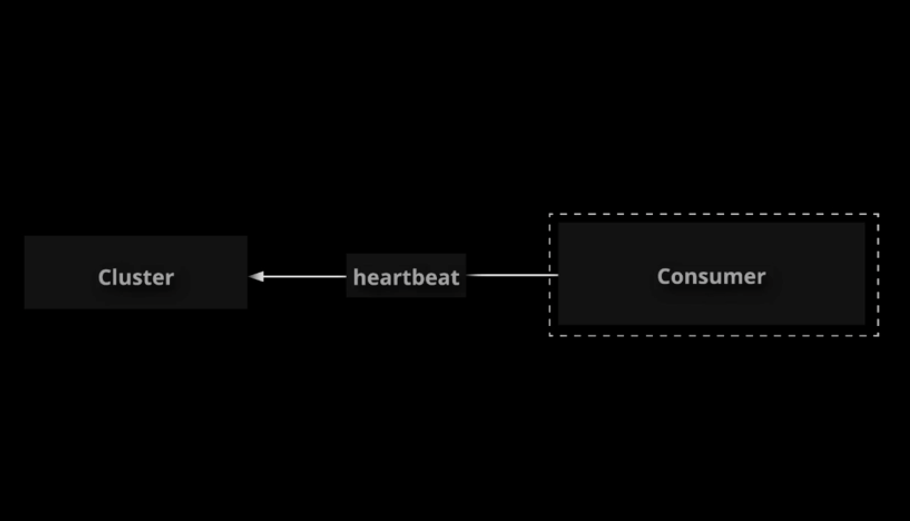
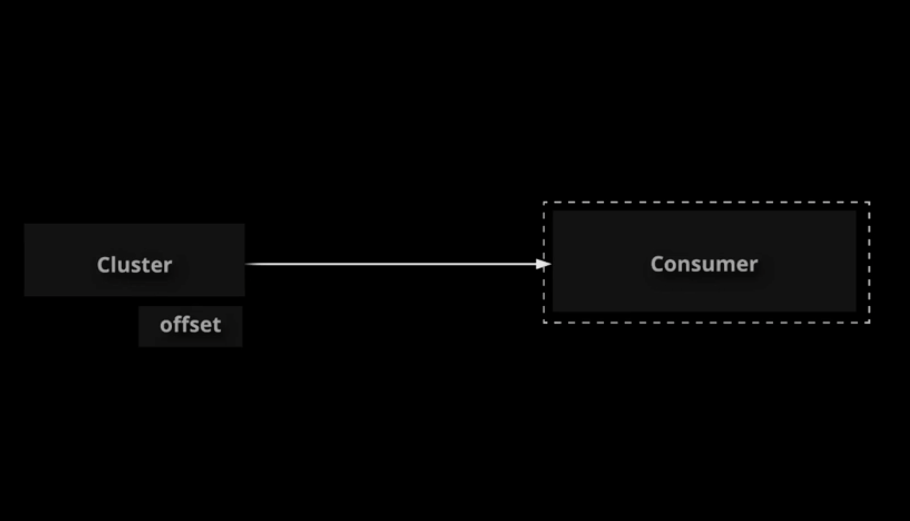
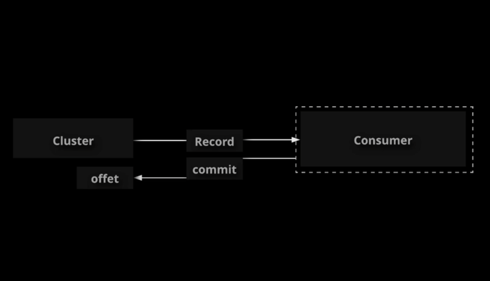
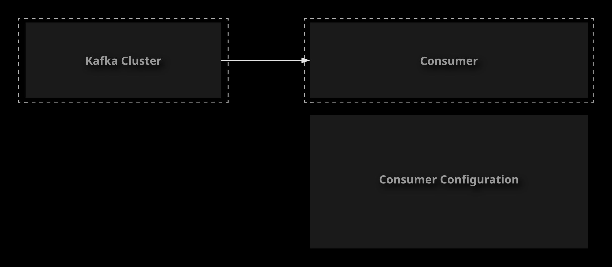

# Working with Clients

## Monitoring Clients

Monitoring is an important component of any infrastructure. We have already talked about connecting to a
cluster via JMX to monitor Kafka, but it is generally a good idea to monitor your Kafka clients as well.
Luckily, you can also connect to Java clients such as producers and consumers via JMX in order to collect
important metrics. In this lesson, we will demonstrate the process of connecting to both a producer and a
consumer via JMX, and we will talk about a few important client metrics that you may need to be aware of.

You can monitor Kafka clients using **JMX** just like brokers.

- Ensure project JVM arguments are set when running you client.
- Connect to the client JVM with a JMX client, for example, **JConsole.

This applies to clients such as the console producer and consumer, as well as your own custom Java clients.

### Producer Metrics

Some important producer metrics:

- `response-rate` (global and per broker)
    Responses (acks) received per second. Sudden changes in this value could signal a problem, though what
    the problem could be depends on you consifiguration.
- `request-rate` (global and per broker)
    Average requests sent per second. Requests can contain multiple records, so this is not the number of
    records. It does give you part of the overall throughput picture.
- `request-latency-avg` (per broker)
    Average request latency in ms. High latency could be a sign of performance issues, or just large batches.
- `outgoind-byte-rate` (global and per broker)
    Bytes sent per second. Good picture of your network throughput. Helps with network planning.
- `io-wait-time-ns-avg` (global only)
    Average time spent waiting for socket ready for reads/writes in nanoseconds. High wait times might mean your
    producers are producing more data than the cluster can accept and process.

### Consumer Metrics

Some important consumer metrics:

- `records-lag-max`
    Maximum record lag. How far the consumer is behind producers. In a situation where real-time processing is
    important, high lag might mean you need more consumers.
- `bytes-consumed-rate`
    Rate of bytes consumed per second. Gives a good idea of throughput.
- `records-consumed-rate`
    Rate of records consumed per second.
- `fetch-rate`
    Fetch requests per second. If this falls suggenly or goes to zero, it may be an indication of problems
    with the consumer.

References:

- [Producer Monitoring](https://kafka.apache.org/documentation/#producer_monitoring)
- [Consumer Monitoring](https://kafka.apache.org/documentation/#consumer_monitoring)

1. Create a sample topic.

    ```sh
    kafka-topic \
        --bootstrap-server zoo1:909 \
        --topic monitor-tes \
        --creat \
        --partitions \
        --replication-fact
    ```

1. Spin up a producer with some JVM arguments to enable connecting via JMX.

    ```sh
    KAFKA_JMX_OPTS="-Dcom.sun.management.jmxremote -Dcom.sun.management.jmxremote.local.only=false -Djava.rmi.server.hostname=localhost" \
    && kafka-console-producer \
        --broker-list zoo1:9092 \
        --topic monitor-test
    ```

1. In a graphical shell, open JConsole and connect to the producer.

    ```sh
    sudo jconsole
    ```

1. Spin up a consumer with some JVM arguments to enable connecting via JMX.

    ```sh
    KAFKA_JMX_OPTS="-Dcom.sun.management.jmxremote -Dcom.sun.management.jmxremote.local.only=false -Djava.rmi.server.hostname=localhost" \
    && kafka-console-consumer \
        --bootstrap-server zoo1:9092 \
        --from-beginning \
        --topic monitor-test
    ```

1. In a graphical shell, open JConsole and connect to the consumer.

    ```sh
    sudo jconsole
    ```

## Producer Tuning



You can tune your producers by changing their configurations to suit your needs.

Some important configurations:

- `acks`
  Determines when the broker will acknowledge the record.
  - `0`
    Producer will not wait for acknowledgement from the server. The record is considered acknowledged as soon
    as it is sent. The producer will not receive certain metadata such as the record offset.
  - `1`
    Record will be acknowledged when the leader writes the record to disk. Note that this creates a single
    point of failure. If the leader fails before followers replicate the record, data loss will occur.
  - `all / -1`
    Record will be acknowledged only when the leader and all replicas have written the record to their disks.
    The acks may take longer, but this provides the maximum data integrity guarantee.
- `retries`
  
  Number of times to retry a record if there is a transient error. if `max.in.flight.requests.per.connection`
  is not set to 1, the retry could cause records to appear in a different order.
- `batch.size`
  
  Producers batch records sharing the same partition into a single request to create fewer requests. This
  specifies the maximum number of bytes in a batch. Messages larger than this size will not be batched.
  Requests can contain multiple batches (one for each partition) if data is going to more than one partition.

References:

- [Producer Configuration](https://kafka.apache.org/documentation/#producerconfigs)

## Consumer Tuning

You can tune your consumers by changing their configurations to suit your needs.

Some important congigurations:

- `fetch.min.bytes`
  
  The minimum amount of data to fetch in a request. If there is not enough data to satisfy this requirement,
  the request will wait for more data before responding. Set this higher to get better throughput in some
  situations at the cost of some latency.
- `heartbeat.interval.ms`
  
  How often to send heartbeats to the consumer coordinator. Set this lower to allow quicker rebalance response
  when a consumer joins or leaves the consumer group.
- `auto.offset.reset`
  
  What to do when the consumer has no initial offset.
  - `latest`
    Start at the latest record.
  - `earliest`
    Start at the earliest record.
  - `none`
    Throw an exception when there is no existing offset data.
- `enable.auto.commit`
  
  Periodically commit the current offset in the background. Use this to determine whether you want to handle
  offsets manually or automatically.

References:

- [Consumer Configurations](https://kafka.apache.org/documentation/#consumerconfigs)

## [Hands-On] Tuning a Kafka Producer


Your supermarket company has a producer that publishes messages to a topic called `member_signups`.
After running this producer for a while in production, three issues have arisen that require some adjustments
to the producer configuration. You have been asked to make some changes to the producer configuration code
to address these issues.

The source code can be [found on GitHub](https://github.com/linuxacademy/content-ccdak-producer-tuning-lab). Clone this project to the broker. You should be able to implement
all the necessary changes in the file `src/main/java/com/linuxacademy/ccdak/producer/MemberSignupsProducer.java`
inside the project.

Make configuration changes to address the following issues:

- Recently, a Kafka broker failed and had to be restarted. Unfortunately, that broker was the leader for a
partition of the `member_signups` topic at the time, and a few records had been committed by the leader but
had not yet been written to the replicas. A small number of records were lost when the leader failed.
Change the configuration so that this does not happen again.
- The producer is configured to retry the process of sending a record when it fails due to a transient error.
However, in a few instances this has caused records to be written to the topic log in a different order
than the order they were sent by the producer, because a record was retried while another record was sent
ahead of it. A few downstream consumers depend on certain ordering guarantees for this data.
Ensure that retries by the producer do not result in out-of-order records.
- This producer sometimes experiences high throughput that could benefit from a greater degree of message
batching. Increase the batch size to 64 KB (`65536` bytes).

When you have implemented your changes, you can run the code with `./gradlew run` to test it against the
development broker.

If you get stuck, feel free to check out the solution video, or the detailed instructions under each objective.
Good luck!

### Clone the Starter Project from GitHub and Perform a Test Run

1. Clone the starter project from GitHub (first changing to the home directory if you aren't already in it):

    ```sh
    cd ~/
    git clone https://github.com/linuxacademy/content-ccdak-producer-tuning-lab.git
    ```

1. Change to the `content-ccdak-producer-tuning-lab` directory:

    ```sh
    cd content-ccdak-producer-tuning-lab
    ```

1. Perform a test run to make sure the code is able to compile and run:

    ```sh
    ./gradlew run
    ```

    The code should compile and tests should succeed.

### Implement the Configuration Changes in the Producer

1. Open the file:

    ```sh
    vi src/main/java/com/linuxacademy/ccdak/producer/MemberSignupsProducer.java
    ```

1. Fix the issue with data loss by setting `acks=all`:

    ```java
    props.put("acks", "all");
    ```

1. Fix the out-of-order record issue caused by retries by setting `max.in.flight.requests.per.connection=1`:

    ```java
    props.put("max.in.flight.requests.per.connection", "1");
    ```

1. Increase the batch size by setting `batch.size=65536`:

    ```java
    props.put("batch.size", "65536");
    ```

1. Save and exit the file.
1. Run your code to verify that it still works:

    ```sh
    ./gradlew run
    ```

## [Hands-On] Tuning a Kafka Consumer



Your supermarket company has a consumer that logs data from the `member_signups` topic to `System.out`.
This consumer acts as a utility to log the data for later auditing. However, there is a series of issues
with this consumer that can be addressed through some minor alterations to its configuration. Examine the
list of issues below and resolve them by implementing the necessary configuration changes in the consumer code.

You can find the [consumer code on GitHub](https://github.com/linuxacademy/content-ccdak-consumer-tuning-lab). Clone this project to the broker server. You can implement your
configuration changes in the consumer class at
`src/main/java/com/linuxacademy/ccdak/consumer/MemberSignupsConsumer.java` inside the project.

Make configuration changes to address the following issues:

- This consumer does not have a high need for real-time data since it is merely a logging utility that
provides data for later analysis. Increase the minimum fetch size to 1 K (`1024` bytes) to allow the
consumer to fetch more data in a single request.
- Changes in consumer status (such as consumers joining or leaving the group) are not being detected
quickly enough. Configure the consumer to send a heartbeat every two seconds (`2000ms`).
- Last week, someone tried to run this consumer against a new cluster. The consumer failed with the
following error message:

    ```txt
    Exception in thread "main" org.apache.kafka.clients.consumer.NoOffsetForPartitionException: Undefined offset with no reset policy for partitions: [member_signups-0]
    ```

    Ensure the consumer has an offset reset policy that will allow the consumer to read from the
    beginning of the log when reading from a partition for the first time.

When you have implemented your changes, you can run the code with `./gradlew run` to test it against the
development broker.

If you get stuck, feel free to check out the solution video, or the detailed instructions under each objective.
Good luck!

### Clone the Starter Project from GitHub and Perform a Test Run

1. Clone the starter project from GitHub (first changing to the home directory if you aren't already in it):

    ```sh
    cd ~/
    git clone https://github.com/linuxacademy/content-ccdak-consumer-tuning-lab.git
    ```

1. Change to the content-ccdak-consumer-tuning-lab directory:

    ```sh
    cd content-ccdak-consumer-tuning-lab
    ```

1. Perform a test run to make sure the code is able to compile:

    ```sh
    ./gradlew run
    ```

    The code should compile, but the consumer will fail to run

### Implement Configuration Changes to Address the Issues

1. Edit the Consumer class:

    ```sh
    vi src/main/java/com/linuxacademy/ccdak/consumer/MemberSignupsConsumer.java
    ```

1. In the public MemberSignupsConsumer properties section, increase the minimum fetch size by setting fetch.min.bytes=1024:

    ```java
    props.setProperty("fetch.min.bytes", "1024");
    ```

1. On the next line, send heartbeats more frequently by setting heartbeat.interval.ms=2000:

    ```java
    props.setProperty("heartbeat.interval.ms", "2000");
    ```

1. Fix the issue with the offset reset behavior by setting auto.offset.reset=earliest:

    ```java
    props.setProperty("auto.offset.reset", "earliest");
    ```

1. Save and exit the file.
1. Run your code to verify it still works:

    ```sh
    ./gradlew run
    ```
