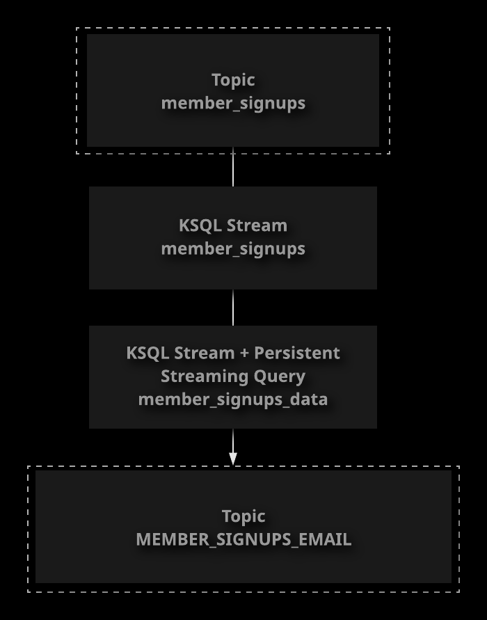
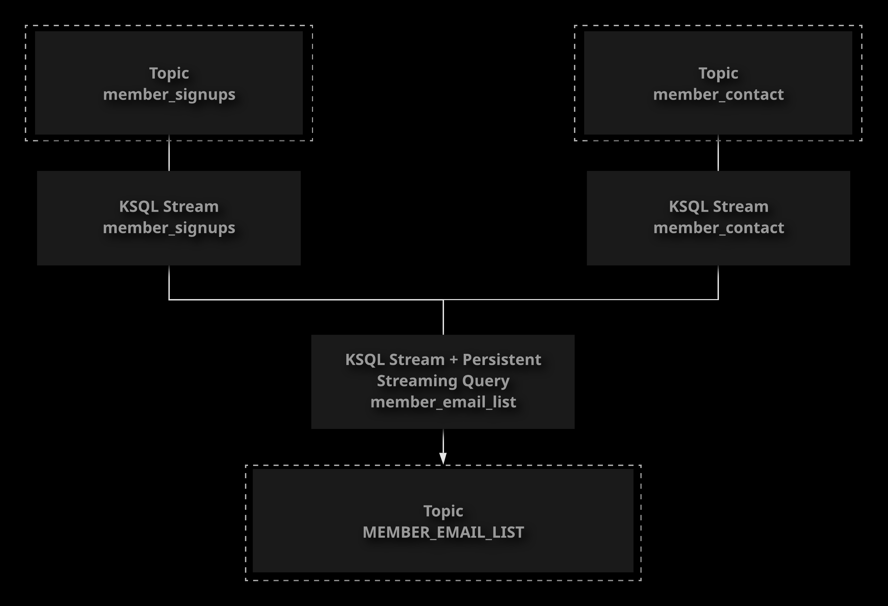

# Confluent KSQL

## What Is KSQL?

Confluent KSQL provides an additional way to leverage Kafka's stream processing capabilities. It allows you
to work with Kafka Streams via SQL-like queries. In this lesson, we will discuss the basics of KSQL and
its architecture. We will also demonstrate how to get a KSQL server up and running.

With KSQL, you can do almost anything that you can do with Kafka Streams, such as:

- Data Transformations
- Aggregations
- Joins
- Windowing
- Modeling data with streams and tables

### KSQL Architecture

KSQL runs as a separate service from Kafka. You can run multiple KSQL servers in a KSQL cluster.

Clients make requests to the KSQL server, and the server communicates with the Kafka cluster.

Confluent comes with a command-line KSQL client that you can access using `ksql` command.

References:

- [KSQL and Kafka Streams](https://docs.confluent.io/current/ksql/docs/index.html)

1. Edit the KSQL server config.

    ```sh
    sudo vi /etc/ksql/ksql-server.properties
    ```

1. Set `bootstrap.servers` and `ksql.streams.state.dir`.

    ```ini
    bootstrap.servers=zoo1:9092
    ksql.streams.state.dir=/tmp/kafka-streams
    ```

1. Start and enable KSQL.

    ```sh
    sudo systemctl start confluent-ksql \
    && sudo systemctl enable confluent-ksql \
    && sudo systemctl status confluent-ksql
    ```

1. Connect to KSQL using the ksql client.

    ```sh
    sudo ksql
    ```

## Using KSQL

KSQL allows you to do nearly anything you can do with Kafka Streams using a SQL-like interface.
In this lesson, we will demonstrate some of the things you can do using KSQL, such as creating streams
and tables from topics and performing a simple aggregation.

KSQL queries look similat to SQL queries, but they query data from Kafka streams and tables.

References:

- [KSQL Developer Guide](https://docs.confluent.io/platform/current/streams-ksql.html)
- [KSQL Tutorials and Examples](https://docs.confluent.io/platform/current/ksqldb/tutorials/index.html)

- List topics:

  ```sql
  SHOW TOPICS;
  ```

- Print records in a topic:

    ```sql
    PRINT `<topic_name>`;
    ```

- Create a stream:

    ```sql
    CREATE STREAM <name> (<fields>)
    WITH (
        kafka_topic=`<topic_name>`,
        value_format=`<format>`
    );
    ```

- Create a table:

    ```sql
    CREATE TABLE <name> (<fields>)
    WITH (
        kafka_topic=`<topic_name>`,
        value_format=`<format>`,
        key=`<key>`
    );
    ```

1. Create a test topic.

    ```sh
    kafka-topics \
        --bootstrap-server zoo1:9092 \
        --create \
        --topic ksql-test \
        --partitions 1 \
        --replication-factor 1
    ```

1. Start a console producer to publish some sample data.

    ```sh
    kafka-console-producer \
        --broker-list localhost:9092 \
        --topic ksql-test \
        --property parse.key=true \
        --property key.separator=:
    ```

1. Publish some sample data to the topic.

    ```txt
    5:5,sarah,2
    7:7,andy,1
    5:5,sarah,3
    ```

1. Start a KSQL session

    ```sh
    sudo ksql
    ```

1. Set `auto.offset.reset` to `earliest`.

    ```sql
    SET 'auto.offset.reset' = 'earliest';
    ```

1. List topics currently in the cluster.

    ```sql
    SHOW TOPICS;
    ```

1. Display records from the `ksql-test` topic.

    ```sql
    PRINT 'ksql-test' FROM BEGINNING;
    ```

1. Create a stream from the `ksql-test` topic.

    ```sql
    CREATE STREAM ksql_test_stream (
        employee_id INTEGER,
        name VARCHAR,
        vacation_days INTEGER
    )
    WITH (
        kafka_topic='ksql-test',
        value_format='DELIMITED'
    );
    ```

1. Create a table from the `ksql-test` topic

    ```sql
    CREATE TABLE ksql_test_table (
        employee_id INTEGER,
        name VARCHAR,
        vacation_days INTEGER
    )
    WITH (
        kafka_topic='ksql-test',
        value_format='DELIMITED',
        key='employee_id'
    );
    ```

1. Select data from a stream.

    ```sql
    SELECT * FROM ksql_test_stream;
    ```

1. Use a select query to perform a `sum` aggregation.

    ```sql
    SELECT SUM(vacation_days) FROM ksql_test_stream GROUP BY employee_id;
    ```

## [Hands-On] Working with KSQL Streams



Your supermarket company has a customer membership program, and they are using Kafka to manage some of the
back-end data related to this program. A topic called `member_signups` contains records that are published
when a new customer signs up for the program. Each record contains some data indicating whether or not the
customer has agreed to receive email notifications.

The email notification system reads from a Kafka topic, so a topic called `member_signups_email` needs to be
created that contains the new member data, but only for members who have agreed to receive notifications.
The company would like to have this data automatically processed in real-time so that consumer applications
can appropriately respond when a customer signs up. Luckily, this use case can be accomplished using KSQL
persistent streaming queries, so you do not need to write a Kafka Streams application.

The data in member_signups is formatted with the key as the member ID. The value is a comma-delimited list
of fields in the form `<last name>,<first name>,<email notifications true/false>`.

Create a stream that pulls the data from `member_signups`, and then create a persistent streaming query to
filter out records where the email notification value is false and output the result to the `member_signups_email` topic.

If you get stuck, feel free to check out the solution video, or the detailed instructions under each objective.
Good luck!

### Create a Stream to Pull Data in from the Topic

1. Start a KSQL session:

    ```sh
    sudo ksql
    ```

1. Set `auto.offset.reset` to `earliest`:

    ```sql
    SET 'auto.offset.reset' = 'earliest';
    ```

1. Look at the data in the `member_signups` topic:

    ```sql
    PRINT 'member_signups' FROM BEGINNING;
    ```

1. Create a stream from the topic:

    ```sql
    CREATE STREAM member_signups(
        firstname VARCHAR,
        lastname VARCHAR,
        email_notifications BOOLEAN
    )
    WITH (
        kafka_topic='member_signups',
        value_format='DELIMITED'
    );
    ```

### Create a Persistent Streaming Query to Write Data to the Output Topic in Real Time

1. Create the persistent streaming query:

    ```sql
    CREATE STREAM member_signups_email AS
        SELECT * FROM member_signups
        WHERE email_notifications=true;
    ```

1. View the data in the output topic to verify that everything is working:

    ```sql
    PRINT 'member_signups_email' FROM BEGINNING;
    ```

## [Hands-On] Joining Datasets with KSQL



Your supermarket company has a customer membership program. Some of the data for this program is managed using
Kafka. There are currently two relevant topics:

- `member_signups` - Key: member ID, value: Customer name.
- `member_contact` - Key: member ID, value: Customer email address.

The company would like to send an email to new members when they join. This email needs to contain the
customer's name, and it needs to be sent to the customer's email address, but these pieces of data are
currently in two different topics. Using KSQL, create a persistent streaming query to join the customer names
and email addresses, and stream the result to an output topic called `MEMBER_EMAIL_LIST`.

If you get stuck, feel free to check out the solution video, or the detailed instructions under each objective.
Good luck!

### Create Streams for Both Input Topics

1. Start a KSQL session:

    ```sh
    sudo ksql
    ```

1. Set `auto.offset.reset` to `earliest` so that all streams will process the existing test data:

    ```sql
    SET 'auto.offset.reset' = 'earliest';
    ```

1. View the data in the `member_signups` topic:

    ```sql
    PRINT 'member_signups' FROM BEGINNING;
    ```

1. Create a stream for the `member_signups` topic:

    ```sql
    CREATE STREAM member_signups (
        lastname VARCHAR,
        firstname VARCHAR
    )
    WITH (
        kafka_topic='member_signups',
        value_format='DELIMITED'
    );
    ```

1. View the data in the `member_contact` topic:

    ```sql
    PRINT 'member_contact' FROM BEGINNING;
    ```

    > You may need to hit `Ctrl+C` to stop the process before the next step.

1. Create a stream for the `member_contact` topic:

    ```sql
    CREATE STREAM member_contact (
        email VARCHAR
    )
    WITH (
        kafka_topic='member_contact',
        value_format='DELIMITED'
    );
    ```

### Create a Persistent Streaming Query to Join the Two Streams and Output the Result

1. Create a persistent streaming query to join the two streams:

    ```sql
    CREATE STREAM member_email_list AS
    SELECT
        member_signups.firstname
        , member_signups.lastname
        , member_contact.email
    FROM member_signups
    INNER JOIN member_contact WITHIN 365 DAYS
        ON member_signups.rowkey = member_contact.rowkey;
    ```

1. Check the output topic to verify the correct data is present:

    ```sql
    PRINT 'member_email_list' FROM BEGINNING;
    ```
