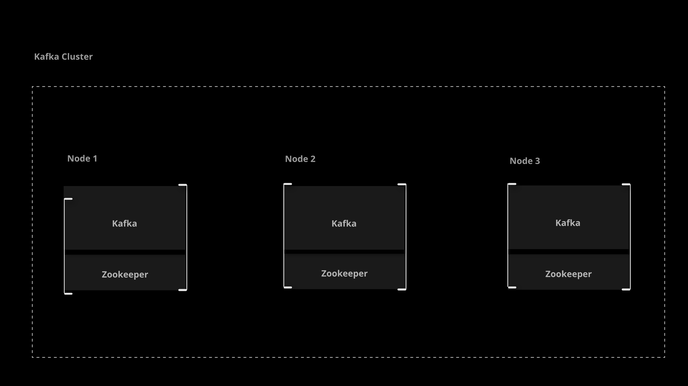

# Building a Practice Cluster

## Setting Up Kafka Servers

To begin working with Kafka, we need to create a **Kafka cluster**. However, before we can construct a Kafka cluster, we must address the configuration for some servers!



Specifications:

- 3 servers
- Distribution: **Ubuntu 18.04 Bionic Beaver LTS** or later
- Size: **1 Large, 2 Small**

## Building a Kafka Cluster

The **Confluent Certified Developer for Apache Kafka (CCDAK)** exam covers the Confluent version of Apache Kafka

**Confluent** is an enterprise platform built on Apache Kafka. Essentially, Confluent is Kafka with some additional enterprise features.

We will be using and installing **Confluent Community**, a free version of Confluent. It includes all of the features of Kafka and Confluent covered by CCDAK exam.

> **Note**: Kafka usually requires no more than **6GB** of JVM heap space.

1. Install:

    ```sh
    wget -qO - https://packages.confluent.io/deb/7.5/archive.key | sudo apt-key add -
    sudo add-apt-repository "deb [arch=amd64] https://packages.confluent.io/deb/7.5 stable main"
    sudo add-apt-repository "deb https://packages.confluent.io/clients/deb $(lsb_release -cs) main"
    sudo apt-get update && sudo apt-get install -y openjdk-8-jdk confluent-community-2.13
    ```

1. Modify /etc/hosts, add all of the servers IP Addresses:
    - `172.31.40.31  zoo1`
    - `172.31.44.5   zoo2`
    - `172.31.45.212 zoo3`
1. Configure Zookeeper on all servers, remove all default conf and replace it with below conf:
    `sudo vi /etc/kafka/zookeeper.properties`

    ```ini
    tickTime=2000
    dataDir=/var/lib/zookeeper/
    clientPort=2181
    initLimit=5
    syncLimit=2
    server.1=zoo1:2888:3888
    server.2=zoo2:2888:3888
    server.3=zoo3:2888:3888
    autopurge.snapRetainCount=3
    autopurge.purgeInterval=24
    ```

1. Add id number in /var/lib/zookeeper/myid file to all of the servers:
    id `1` for first server (L1/zoo1)
    id `2` for first server (S1/zoo2)
    id `3` for first server (S2/zoo3)

1. Configure Kafka:
    `sudo vi /etc/kafka/server.properties`

    1. Chagne `broker.id` value same as myid for zookeeper id (e.g: `1`)
    2. Change `advertised.listeners` value same as hostname for zookeeper server (e.g:  `PLAINTEXT://zoo1:9092`)
    3. Change `zookeeper.connect` value to an itself hostname or to `zoo1` for all of servers (e.g: `zoo1:2181`), to make it simple for now just set it to `zoo1` for all of the servers, of course this have implication in production.

1. Start Zookeeper on all of the servers and wait a few seconds:

    ```sh
    sudo systemctl start confluent-zookeeper
    sudo systemctl enable confluent-zookeeper
    ```

1. Start Kafka on all of the servers:

    ```sh
    sudo systemctl start confluent-kafka
    sudo systemctl enable confluent-kafka
    ```

1. Check the status of the services:

    ```sh
    sudo systemctl status confluent*
    ```

1. Tested it out:
    Below command should be returning the list of defualt topics

    `__confluent.support.metrics`

    ```sh
    kafka-topics --list --bootstrap-server localhost:9092
    ```

Reference:

- [Confluent Manual Installation](https://docs.confluent.io/platform/current/installation/installing_cp/deb-ubuntu.html#systemd-ubuntu-debian-install)
