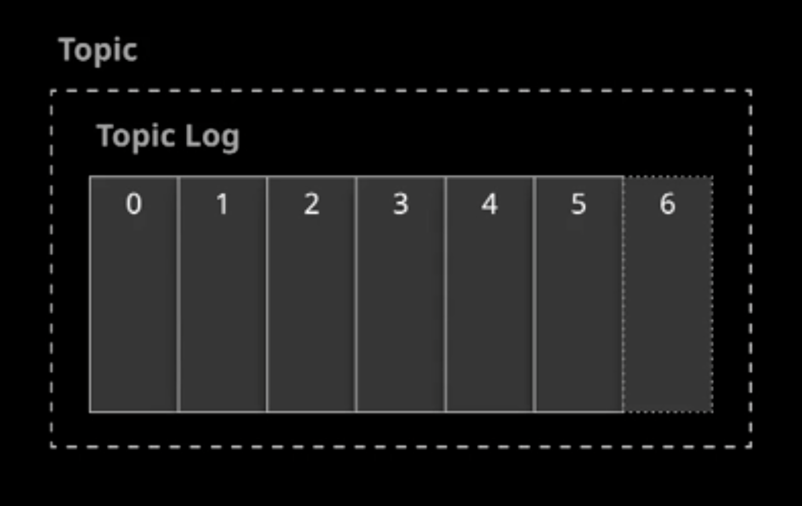
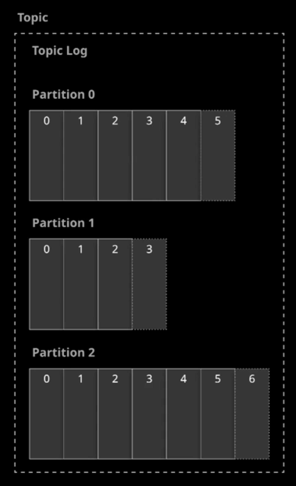
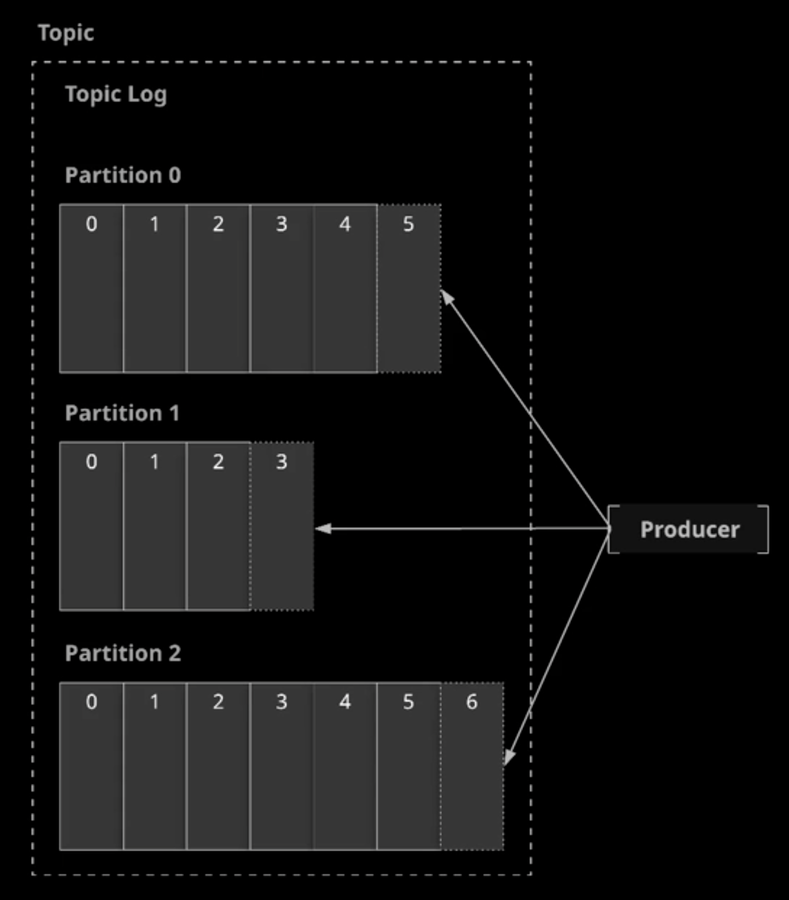
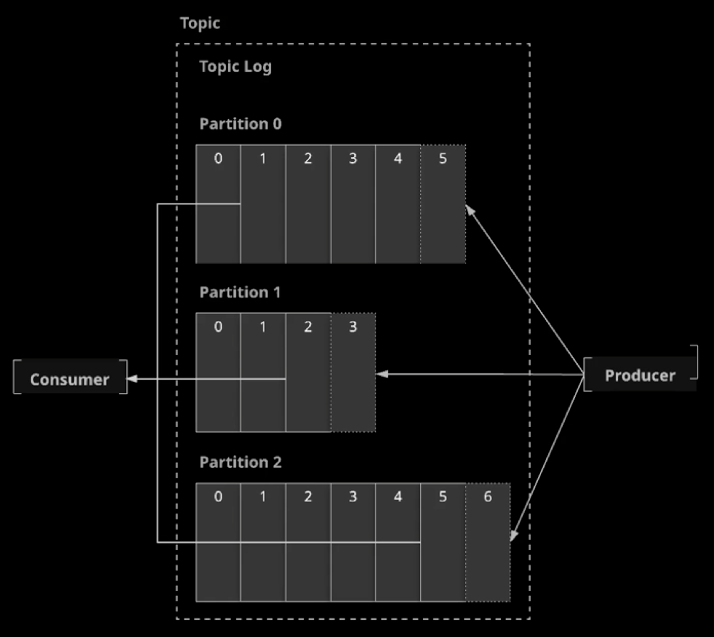
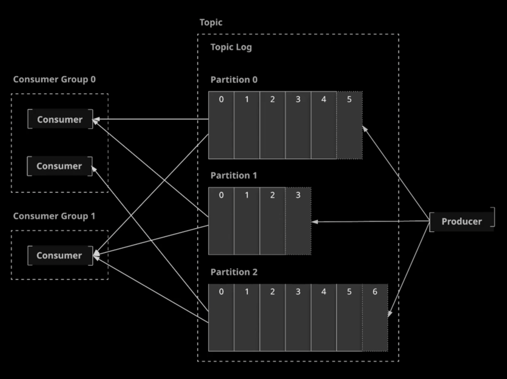
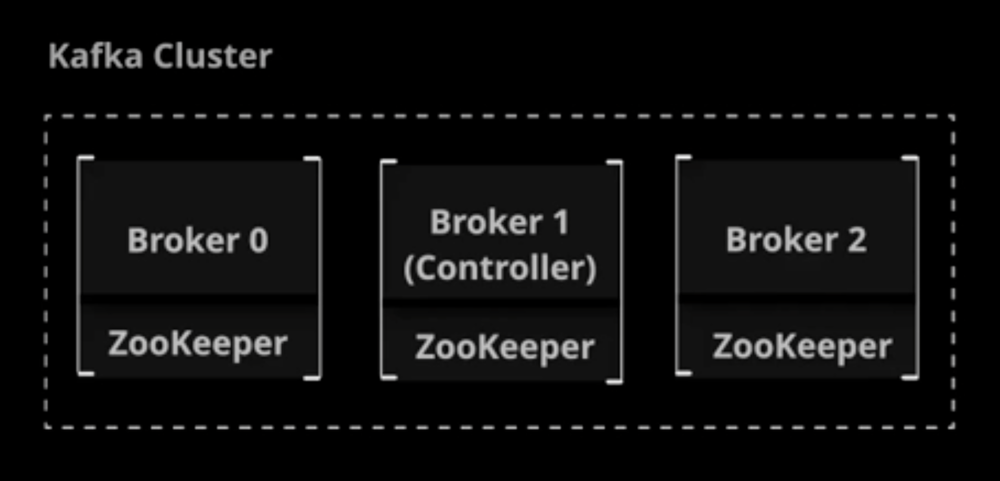
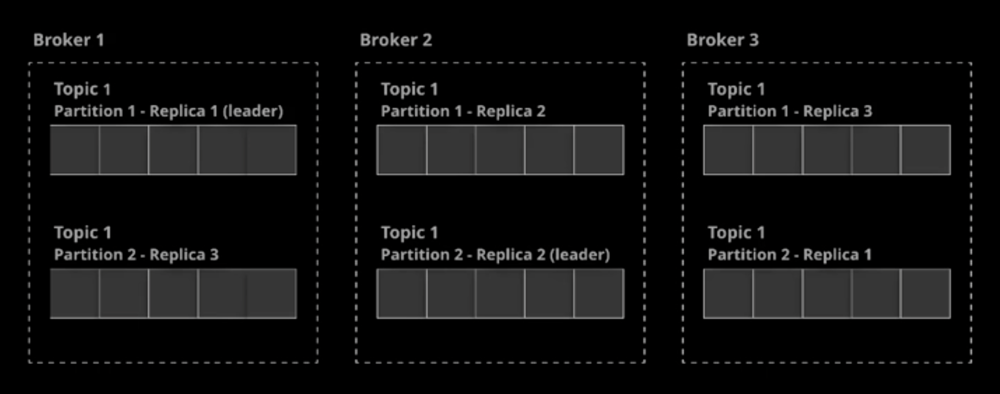
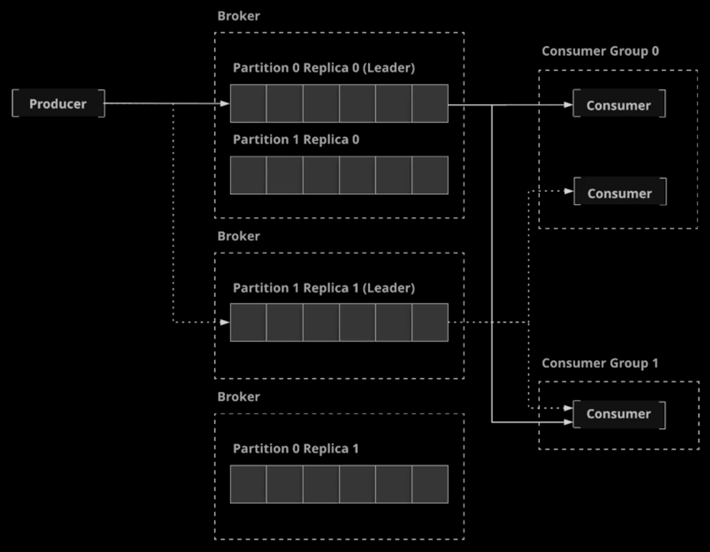

# Kafka Architecture Basics

## What is Apache Kafka?

The Kafka documentations describes Apache Kafka as a "_distributed steaming platform_".

This means that Kafka enables you to:

- Publish and Subscribe to streams of data records
- Store the records in a fault-tolerant and scalable fashion
- Process streams of records in real-time

Some background:

- Kafka is written in Java
- Originally created at Linkedin
- Became open source in 2011

### Use Cases

1. Messaging
    Building real-time streaming data pipelines that reliable get data between systems or applications
    **Example:**
    An online store appliciation. When a customer makes a purchase, the application sends the order data to a
    backend that hanles fulfillment/shopping. You can use a messaging platform like Kafka to ensure that
    this data is passed to the backend application reliable and with no data loss, even if the backend application
    or one of your Kafka servers goes down
1. Streaming
    Building real-time streaming applications that transform or react to the streams of data
    **Example**
    Log aggregation. Your have multiple servers creating log data. You can feed the data to Kafka and use
    streams to transform the data into a standardized format, the combine the log data from all of the
    servers into a single feed for analysis

### Some Benefits of Kafka

- Strong reliability guarantees
- Fault tolerance
- Robust APIs

References:

- [Intro to Apache Kafka Documentation](https://kafka.apache.org/documentation/#introduction)
- [Apache Kafka Use Cases](https://kafka.apache.org/uses)

## Kafka from command line

Kafka makes it easy to write code that communicates with a Kafka cluster, but sometimes we may need to interact with the
cluster directly from the command line. In this lesson, we will discuss the various command line tools offered by Kafka as well as how to access them.

### Relevant Documentation

- [Kafka Quick Start](https://kafka.apache.org/documentation/#quickstart)
- [Confluent CLI](https://docs.confluent.io/current/cli/index.html)

## Lesson Reference

1. Download the Kafka binaries:

    ```sh
    wget http://mirror.cogentco.com/pub/apache/kafka/2.2.0/kafka_2.12-2.2.0.tgz
    tar -xvf kafka_2.12-2.2.0.tgz
    mv kafka_2.12-2.2.0 kafka
    cd kafka/
    ```

1. Use the shell scripts that come with the Kafka binaries to list the topics in the cluster:

    ```sh
    ./bin/kafka-topics.sh --bootstrap-server localhost:9092 --list
    ```

1. List the shell scripts:

    ```sh
    ls -l ./bin/
    ```

1. Use the kafka-topics command that comes with the Confluent package installation to list the topics in the cluster:

    ```sh
    kafka-topics --bootstrap-server localhost:9092 --list
    ```

1. List the Kafka shell scripts that were installed with the Confluent packages:

    ```sh
    ls -l /usr/bin | grep kafka
    ```

1. Run the confluent command:
    `confluent` CLI is a unique and specific to the confluent that comes with the confluent package,
    this tool is just provide some extra functionality allowing us to manage the Kafka components, it is
    really there just to help to get quickly up and running for the development purposes
    **But don't use `confluent` CLI in Production environment** and confluent don't recommend it!

    ```sh
    confluent
    ```

## Publisher/Subscriber Messaging

### Topics

**Topics** are at the core of everything you can do in Kafka.

A topic is a data feed to which data records are published and from which they can be consumed.

Publishers send data to a topic, and subscribers read data from the topic. This is known as
_publisher/subscriber messaging_, or simply _pub/sub_ for short.

### The Topic Logs



Kafka topics each maintain a log.

The _log_ is an orderd, immutable list of data records.



The log for Kaka topic is usually devided into multiple _partitions_. This is what allows Kafka to process
data efficiently ad in a scalable fashion.

Each records in a partition has a sequential, unique ID called an _offset_.

### Producers



A _Producer_ is the publisher in the pub/sub model. The producer is simply an application that communicates
with the cluster, and can be in a separate process or on a different server.

Producers write data records to the Kafka topic.

For each new record, the Producer determines which partition to write to, often in a simple round-robin
fashion. You can customize this to use a more sophisticated algorithm for determining which topic to write
a new record to.

### Consumers



A _Consumer_ is the subscriber in the pub/sub model. Like producers, consumers are external applications that
can be in a separate process or on a different server from Kafka itself.

Consumers read data from Kafka topics. Each consumer controls the offset it is currently reading for each partition,
and consumer normally read records in order based in the offset.

You can have any number of consumers for a topic, and they can all process the same records.

Records are not deleted when they are consumed. They are only deleted based upon a configurable retention period.

### Consumer Groups



By default, all consumers will process all records, but what if you want to scale your record processing so that
multiple instances can process the data without two instances processing the same record?

You can places a consumers into _Consumer Groups_. Each record will be consumed by exactly one consumer per
consumer group.

WIth consumer groups, Kafka dynamically assigns each parttion to eactly one consumer in the groups. If you have
consumers than partitions, some of the consumers will be idle and will not process records.

## Terms

- **Topic**: A named data feed that data can be written to and read from.
- **Log**: The data structure used to store a topic's data. The log is a  partitioned, immutable sequence of
data records.
- **Partition**: A section of a topic's log.
- **Offset**: The sequential and unique ID of a data records within a partition.
- **Producer**: Something that writes data to a topic.
- **Consumer**: Something that reads data from a topic.
- **Consumer Group**: A group of multiple consumers. Normally, multiple consumers can all consume the same
record from a topic, but only one consumer in a consumer group will consume each record.

## Kafka Architecture

### Brokers



The central component of Kafka architecture is the broker.

_Broker_ are the servers that make up a _Kafka Cluster_ (one or more brokers).

Producers and consumers communicate with the brokers in order to publish and consume messages.

### Zookeeper

Kafka depends on an underlying technology called Zookeeper.

Zookeeper is a generalized cluster management tool. It manages the cluster and provides a consistent, distributed place to store cluster configuration.

Zookeeper coordinates communication throughout the cluster, adds and removes brokers, and monitors the status of nodes in the Cluster. It is ofter installed alongside Kafka, but can be mantained on a completely separate set of servers.

### Networking

Kafka uses a simple TCP protocol to handle messaging communication between brokers in the cluster.

### The Controller

In a Kafka cluster, one broker is dynamically designated as the _Controller_. The controller coordinates the process of
assigning partitions and data replicas to nodes in the cluster.

Every cluster has exactly one controller. If the controller goes down, another node will automatically become the controller.

Reference:

- [Kafka Controller Internals](https://cwiki.apache.org/confluence/display/KAFKA/Kafka+Controller+Internals)

## Partitions and Replication

### Replication

Part of Kafka's approach to fault tolerance involves maintaining replicas of topic partition data. In this lesson, we will discuss
the relationship between partitions and replicas. We will also talk about the concepts of leader election and in-sync replicas as
they relate to data replication in Kafka.



Kafka is deigned with fault tolerance in mind. As a result, it includes built-in support for replication.

_Replication_ means store multiple copies of any given piece of data.

In Kafka, every topic is given a configurable replication factor.

The _replication factor_ is the number of replicas that will be kept on different brokers for each partition
in the topic.

1. Create a topic with multiple partitions and a replication factor greater than 1:

    ```sh
    kafka-topics --bootstrap-server localhost:9092 --create --topic my-topic --partitions 3 --replication-factor 2
    ```

1. Describe the topic to view information about its partitions and replicas:

    ```sh
    kafka-topics --bootstrap-server localhost:9092 --describe --topic my-topic
    ```

    ```plain
    Topic: my-topic TopicId: XqlsqjAYR9a36NgJmspwhg PartitionCount: 3       ReplicationFactor: 2    Configs:
        Topic: my-topic Partition: 0    Leader: 1       Replicas: 1,3   Isr: 1,3
        Topic: my-topic Partition: 1    Leader: 2       Replicas: 2,1   Isr: 2,1
        Topic: my-topic Partition: 2    Leader: 3       Replicas: 3,2   Isr: 3,2
    ```

    Explanation:

    - we have 1 topic called `my-topic`
    - inside `my-topic` we have 3 partition and 2 replica
    - for first partition (`0`) has a replicas in broker-1 and broker-3 and the leader of this partition is in broker-1
    - for second partition (`1`) has a replicas in broker-2 and broker-1 and the leader of this partition is in broker-2
    - for third partition (`2`) has a replicas in broker-3 and broker-2 and the leader of this partition is in broker-3

#### Leaders

In order to ensure that messages in a partition are kept in a consistent order across all replicas, Kafka
chooses a **leader** for each partition (source of truth of the data).

The leader handles all reads and writes for the partition. The leader is dynamically selected and if the leader
goes down, the cluster attempts to choose a new leader through a process called _leader election_.

#### In-Sync Replicas

Kafka maintains a list of **In-Sync Replicas (ISR) for each partition.

ISRs are replicas that are up-to-date with the leader. If a leader dies, the new leader is elected from among the ISRs.

By default, if there are no remaining ISRs when a leader dies, Kafka waits until one becomes available. This means that producers will be on hold until a new leader can be elected.

**Why ISR is important?**
ISR is very important when it comes to a leader election because we will loose our data if Kafka choose a replica that is out-of-sync

**What happens if there are no In-Sync Replicas?**
What happens if all the replicas are out-of-sync or all of the servers are down?
By default Kafka is just going to wait until in-sync replicas becomes available, what that means is it's not going to accept any new messages to that topic and any producers that are trying to write to that topic are going to be on hold
until an in-sync replicas becomes available.

If you have a use case or you're not really all that concern about that high level data integrity, then ou can turn on **unclean leader election**, allowing the cluster to elect a non-in-sync replica in this scenario.

Reference:

- [Replication](https://kafka.apache.org/documentation/#replication)

## The Life of Message



- **Producer** publishes a mesage to a **partition** within a **topic**.
- The message is added to the partition on the **leader**.
- The message is **copied to the replicas** of that partition on other brokers.
- **Consumers** read the message and process it.
- When the **retention period** for the message is reached, the message is deleted.

## [Hands-On] Working with Kafka from the Command Line

Your supermarket company has a three-broker Kafka cluster. They want to use Kafka to track purchases so they can keep track of their inventory and are working on some software that will interact with the Kafka cluster to produce and consume this data.

However, before they can start using the cluster, they need you to create a topic to handle this data. You will also need to test that everything is working by publishing some data to the topic, and then address consuming it. Since the application is being built, you will need to do this using Kafka's command line tools.

Create a topic that meets the following specifications:

The topic name should be `inventory_purchases`.
Number of partitions: `6`
Replication factor: `3`
Publish some test data to the topic. Since this is just a test, the data can be anything you want, but here is an example:

```txt
product: apples, quantity: 5
product: lemons, quantity: 7
```

Set up a consumer from the command line and verify that you see the test data you published to the topic.

This cluster is a confluent cluster, so you can access the Kafka command line utilities directly from the path, i.e. `kafka-topics`.

If you get stuck, feel free to check out the solution video, or the detailed instructions under each objective. Good luck!

### Create a Kafka Topic for the Inventory Purchase Data

1. Create the topic using the kafka-topics command:

    ```sh
    kafka-topics
        --create
        --bootstrap-server localhost:9092
        --replication-factor 3
        --partitions 6
        --topic inventory_purchases
    ```

### Test the Setup by Publishing and Consuming Some Data

1. Start a command line producer:

    ```sh
    kafka-console-producer
        --broker-list localhost:9092
        --topic inventory_purchases
    ```

1. Type in a few lines of test data. Since we are working with merely test data, a specific format is not required. It could look like this:

    ```txt
    product: apples, quantity: 5
    product: lemons, quantity: 7
    ```

1. Once the test messages are published, we can exit the producer.
1. Start up a command line consumer:

    ```sh
    kafka-console-consumer
        --bootstrap-server localhost:9092
        --topic inventory_purchases
        --from-beginning
    ```

1. We should see the test messages that were published earlier:

    ```txt
    product: apples, quantity: 5
    product: lemons, quantity: 7
    ```

## [Hands-On] Consuming Kafka Messages with Multiple Consumer Groups

Your supermarket company is getting ready to use Kafka to process purchase data to track changes in inventory. When a customer purchases an item, data about the name of the item and quantity purchased will be published to a topic called `inventory_purchases` in the Kafka cluster.

The company is working on determining the best way to consume this data, and they want you to perform a proof-of-concept for the proposed consumer setup. Your task is to set up some consumers following a specified configuration, and then examine the message data processed by these consumers. Lastly, you will store some sample data that demonstrates what messages get processed by each consumer.

The system currently is set up so that a stream of sample data gets continuously produced to the topic.

Consume the data according to the following specifications:

1. Consume the data from the `inventory_purchases` topic.
1. Set up a consumer and wait for it to process some data.
1. Store the output in `/home/cloud_user/output/group1_consumer1.txt`.
1. Set up a separate consumer group with two consumers in that group.
1. Wait for them to process some messages simultaneously.
1. Store the output in `/home/cloud_user/output/group2_consumer1.txt` and `/home/cloud_user/output/group2_consumer2.txt`.

You have been given a three-broker Kafka cluster to complete this task but should perform all of your work on `Broker 1`.

If you get stuck, feel free to check out the solution video, or the detailed instructions under each objective. Good luck!

### Set Up the First Consumer Group with One Consumer

1. Set up the first consumer as the sole consumer in its group.
Consume some messages and save the output to `/home/cloud_user/output/group1_consumer1.txt`.
    The format should look like this:

    ```sh
    kafka-console-consumer
        --bootstrap-server localhost:9092
        --topic inventory_purchases
        --group 1 > /home/cloud_user/output/group1_consumer1.txt
    ```

> **Note**: The --topic called inventory_purchases exists already and messages are being published to it.

1. Let it run for a few seconds, and then use the Ctrl + C shortcut to verify the number of messages being consumed.
1. We can check on the consumed messages by running:

    ```sh
    cat /home/cloud_user/output/group1_consumer1.txt
    ```

> **Note**: Sometimes the data may appear out of order, but there should not be any sequence gaps between messages.

### Set Up a Second Consumer Group with Two Consumers

1. Create a consumer in a separate group, and store its output in `/home/cloud_user/output/group1_consumer1.txt`:
    It should look like this:

    ```sh
    kafka-console-consumer
        --bootstrap-server localhost:9092
        --topic inventory_purchases
        --group 2 > /home/cloud_user/output/group2_consumer1.txt
    ```

1. Create a second consumer in the same group, and store its output in `/home/cloud_user/output/group2_consumer2.txt`:

    ```sh
    kafka-console-consumer
        --bootstrap-server localhost:9092
        --topic inventory_purchases
        --group 2 > /home/cloud_user/output/group2_consumer2.txt
    ```

1. Use Ctrl + C on both of the consumers to view the number of messages being processed.
1. Check the consumed messages on the first consumer with:

    ```sh
    cat /home/cloud_user/ouput/group2_consumer1.txt
    ```

1. Check the consumed messages on the second consumer with:

    ```sh
    cat /home/cloud_user/output/group2_consumer2.txt
    ```

> **Note**: The first consumer that we ran will exhibit more messages due to the run time being a tad longer than the second consumer. A message that is not consumed by the first gets consumed by the second.
