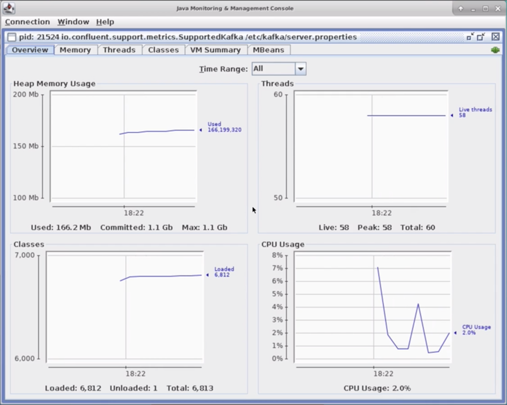
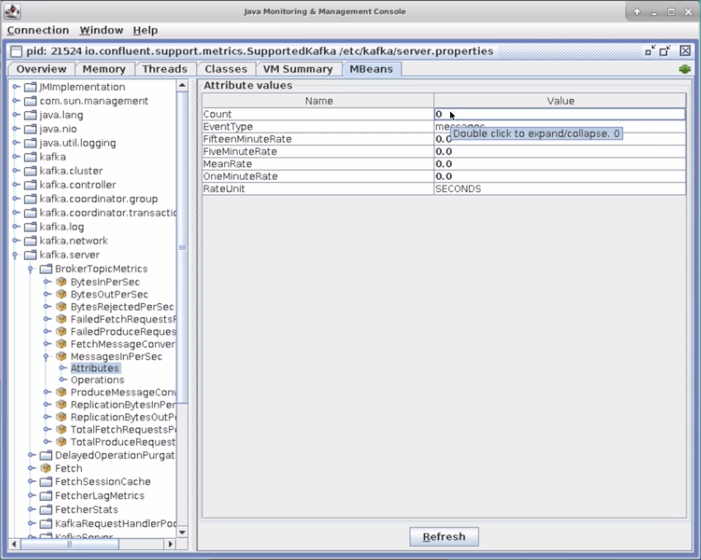
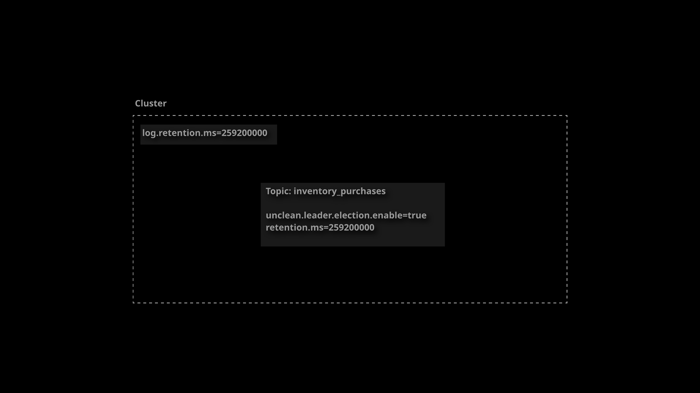
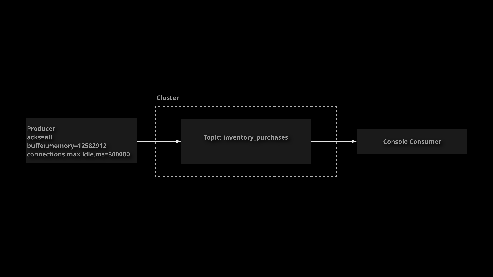

# Advanced Application Design Concepts

## Kafka Configuration

Kafka provides a wide range of configuration options, allowing you to customize Kafka's behavior for your
particular use cases. In this lesson, we will discuss Kafka configuration as it applies to brokers, topics,
and clients. We will also briefly demonstrate how to interact with broker, topic, and client configurations.

Kafka objects such as brokers, topics, producers, and consumers can all be customized using configuration.

Kafka uses the **property file format** for configuration. All configuration options are provided using key-value pairs, for example: `broker.id=1`

With Kafka, you can configure the following:

- Brokers
  You can configure your Kafka broker using `server.properties`, the **command line**, or even programmatically using the **AdminClient API**.

  Some broker configs can be changed dynamically (without a broker restart). Check the documentaton to see which configs
  can be dynamically update.

  - **read-only**: These configs require a broker restart in order to be updated.
  - **per-broker**: These can be dynamically updated for each individual broker.
  - **cluster-wide**: These configs can be updated per-broker, but the cluster-wide default can also be dynamically updated.
- Topics
  Topics can be configured using the command line tools (i.e. `kafka-topics` or `kafka-configs`), as well as
  programmatically

  All topic configurations have a `broker-wide default`. The default values will be used unless an override is
  specified for a particualr topic

  Use the `--config` argument with `kafka-topics` to override default configuration values when creating topics
  from the command line
- Clients (Producers, Consumers, Streams Applications, etc.)

References:

- [Kafka Configuration](https://kafka.apache.org/documentation/#configuration)
- [Kafka Config](https://kafka.apache.org/documentation/#config)
- [Kafka Broker Config](https://kafka.apache.org/documentation/#brokerconfigs)
- [Kafka Topic Config](https://kafka.apache.org/documentation/#topicconfigs)

### Broker Configs

1. List the current configurations for `broker 1`.

    ```sh
    kafka-configs
        --bootstrap-server localhost:9092
        --entity-type brokers
        --entity-name 1
        --describe
    ```

1. Modify the configuration for `broker 1` by setting `log.cleaner.threads` to `2`.

    ```sh
    kafka-configs
        --bootstrap-server localhost:9092
        --entity-type brokers
        --entity-name 1
        --alter
        --add-config log.cleaner.threads=2
    ```

1. List the configurations for `broker 1` to see the newly added configuration.

    ```sh
    kafka-configs
        --bootstrap-server localhost:9092
        --entity-type brokers
        --entity-name 1
        --describe
    ```

### Topic Configs

1. Create a new topic with a configuration override.

    ```sh
    kafka-topics
        --bootstrap-server localhost:9092
        --create
        --topic configured-topic
        --partitions 1
        --replication-factor 1
        --config max.message.bytes=64000
    ```

1. List the configurations for the topic to see the configuration override.

    ```sh
    kafka-configs
        --zookeeper localhost:2181
        --entity-type topics
        --entity-name configured-topic
        --describe
    ```

1. Modify the configuration override for the existing topic.

    ```sh
    kafka-configs
        --zookeeper localhost:2181
        --entity-type topics
        --entity-name configured-topic
        --alter
        --add-config max.message.bytes=65000
    ```

1. List the topic configurations again to see the changes.

    ```sh
    kafka-configs
        --zookeeper localhost:2181
        --entity-type topics
        --entity-name configured-topic
        --describe
    ```

1. Modify a broker-wide default topic configuration.

    ```sh
    kafka-configs
        --bootstrap-server localhost:9092
        --entity-type brokers
        --entity-name 1
        --alter
        --add-config message.max.bytes=66000
    ```

1. View the broker configuration to see the changes to the default.

    ```sh
    kafka-configs
        --bootstrap-server localhost:9092
        --entity-type brokers
        --entity-name 1
        --describe
    ```

### Client Configs

You can configure clients programmatically in Java using a Properties object. [Here is an example](https://github.com/linuxacademy/content-ccdak-kafka-java-connect/blob/end-state/src/main/java/com/linuxacademy/ccdak/kafkaJavaConnect/Main.java):

```java
package com.linuxacademy.ccdak.kafkaJavaConnect;

import org.apache.kafka.clients.producer.*;
import java.util.Properties;

public class Main {

    public static void main(String[] args) {
        Properties props = new Properties();
        props.put("bootstrap.servers", "localhost:9092");
        props.put("key.serializer", "org.apache.kafka.common.serialization.StringSerializer");
        props.put("value.serializer", "org.apache.kafka.common.serialization.StringSerializer");
        Producer<String, String> producer = new KafkaProducer<>(props);
        for (int i = 0; i < 100; i++) {
            producer.send(new ProducerRecord<String, String>("count-topic", "count", Integer.toString(i)));
        }
        producer.close();
    }

}
```

## Topic Design

WHen using Kafka to address a given use case, it is important design your topics for maximum performance.

The two main considerations when designing topics are **partitioncs** and **replication factor**.

Some questions to consider when designing your topics:

- **How many brokers do you have?**
    The number of brokers limits the number of replicas.
- **What is your need for fault tolerance?**
    A higher replication factor means greated fault tolerance.
- **How many consumers do you want to place in a consumer group for parallel processing?**
    You will need at least as many partitions as the number of consumers you expect to have on a single group.
- **How much memory is available on each broker?**
    Kafka requires memory to process messages. The configuration setting `setting.fetch.max.bytes` (default ~1 MB)
    determines the rough amount of memory you will need for each partition on a broker.

## Metrics and Monitoring

Monitoring and metrics are important for supporting any production system. Luckily, Kafka provides access to
a variety of metric data points using the standard JMX protocol for Java monitoring. In this lesson, we will briefly
discuss Kafka metrics, and we will demonstrate how to connect to a Kafka broker using JConsole so that you
can browse the available metrics data.

Both Kafka and Zookeeper offer metrics through **JMX**, a built-in Java technology for providing and accessing performance metric data.

You can access metrics from Kafka brokers as well as your Kafka client applications.

Because JMX is native and part of Java, many different monitoring and metrics gathering platform support JMX natively, which means it is very easy to pull these data automatically into whatever software you use for monitoring your production
systems, so feel free to explore!. You can find a fill list of available metrics in the Kafka documentation.

References:

- [Kafka Monitoring](https://kafka.apache.org/documentation/#monitoring)

1. Edit your Kafka unit file.

    ```sh
    sudo vi /lib/systemd/system/confluent-kafka.service
    ```

1. Add the following line under the `[Service]` block.

    ```sh
    Environment=KAFKA_JMX_OPTS="-Dcom.sun.management.jmxremote -Dcom.sun.management.jmxremote.local.only=false -Djava.rmi.server.hostname=localhost"
    ```

1. Reload the daemon to pick up the changes to the unit file, and restart the service.

    ```sh
    sudo systemctl daemon-reload
    sudo systemctl restart confluent-kafka
    ```

1. Make sure Kafka is able to start up successfully after making the changes.

    ```sh
    sudo systemctl status confluent-kafka
    ```

1. In Cloud Playground, start a graphical shell for your first Kafka broker (the large server).
1. In the graphical shell, open a terminal and start `JConsole`.

    ```sh
    sudo jconsole
    ```

1. Under `Local Process`, select the item that begins with `io.confluent.support.metrics.SuppertedKafka`, and click
`Connect`.
1. When you see a dialog stating `Secure connection` failed , click `Insecure connection` . After a few moments you should
be connected to your Kafka broker via JMX. You can explore `JConsole` to see what metrics are available for the broker




## [Hands-On] Configuring Kafka Topics



Your supermarket company is using Kafka to handle data related to inventory. They have a topic called
`inventory_purchases` that manages some of this data, but initial testing has determined that some
configuration changes are needed.

Implement the following configuration changes in the cluster:

- For the `inventory_purchases` topic, it is more important to maintain availability than data consistency
since inventory errors can be reconciled later.
Turn on `unclean.leader.election` for the `inventory_purchases` topic (`unclean.leader.election.enable=true`).
- The majority of uses cases planned for this cluster do not require a lengthy retention period.
Set the default retention period for the cluster (`log.retention.ms`) to 3 days (`259200000 ms`).
- Change the retention period (`retention.ms`) for the existing `inventory_purchases` topic to 3 days (`259200000 ms`).

If you get stuck, feel free to check out the solution video, or the detailed instructions under each objective. Good luck!

1. Set `unclean.leader.election.enable` to `true` for the topic:

    ```sh
    kafka-configs
        --zookeeper localhost:2181
        --entity-type topics
        --entity-name inventory_purchases
        --alter
        --add-config unclean.leader.election.enable=true
    ```

1. Set the default retention period for the cluster to `259200000 ms` (3 days):

    ```sh
    kafka-configs
        --bootstrap-server localhost:9092
        --entity-type brokers
        --entity-default
        --alter
        --add-config log.retention.ms=259200000
    ```

    > Note: After running this command, should see a Completed updating default config for brokers in the cluster message.

1. Set the retention period for the topic to `259200000 ms`:

    ```sh
    kafka-configs
        --zookeeper localhost:2181
        --entity-type topics
        --entity-name inventory_purchases
        --alter
        --add-config retention.ms=259200000
    ```

1. View the configurations and confirm that the changes were applied via `--describe`:

    ```sh
    kafka-configs
        --bootstrap-server localhost:9092
        --entity-type brokers
        --entity-default
        --describe

    kafka-configs
        --zookeeper localhost:2181
        --entity-type topics
        --entity-name inventory_purchases
        --describe
    ```

## [Hands-On] Configuring a Kafka Client



Your supermarket company has a Kafka producer application that is written in Java. You have been asked to
implement some configuration changes in this application, and then execute it to test those changes.
The base application code has already been written. You can clone a copy of the source code from GitHub to
modify and test it. Implement the required configuration changes and run the program to verify that
everything works as expected.

These are the configuration changes you will need to implement for the producer:

- Set `acks` to `all` to ensure maximum data integrity in case a partition leader fails.
- A smaller amount of memory needs to allocated for the producer to buffer messages.
    Set `buffer.memory` to `12582912` (about 12 MB).
- The producer will need to clean up idle connections more quickly then the default setting specifies.
    Set `connections.max.idle.ms` to `300000` ms (5 minutes).

You can find the producer project code at [https://github.com/linuxacademy/content-ccdak-kafka-client-config-lab.git](https://github.com/linuxacademy/content-ccdak-kafka-client-config-lab.git).
Clone this project into `/home/cloud_user` on `Broker 1`. The producer is implemented in the `Main`
class located at `src/main/java/com/linuxacademy/ccdak/client/config/Main.java`.

You can execute the producer to test your changes by running this command while in the
`/home/cloud_user/content-ccdak-kafka-client-config-lab` directory:

```sh
./gradlew run
```

If you want to view the output data published to the topic by the publisher, then use this command:

```sh
kafka-console-consumer
    --bootstrap-server localhost:9092
    --topic inventory_purchases
    --property print.key=true
    --from-beginning
```

If you get stuck, feel free to check out the solution video, or the detailed instructions under each objective. Good luck!

1. Clone the producer source code into the `home` directory:

    ```sh
    cd ~/
    git clone https://github.com/linuxacademy/content-ccdak-kafka-client-config-lab.git
    ```

1. To view the creation in the `home` directory, we can use the following command:

    ```sh
    ls
    ```

1. Run the code to ensure it works before modifying it:

    ```sh
    cd content-ccdak-kafka-client-config-lab
    ./gradlew run
    ```

1. To view the output, consume the records from the `inventory_purchases` topic:

    ```sh
    kafka-console-consumer
        --bootstrap-server localhost:9092
        --topic inventory_purchases
        --property print.key=true
        --from-beginning
    ```

1. Edit the `Main` class of the producer source code:

    ```sh
    vi src/main/java/com/linuxacademy/ccdak/client/config/Main.java
    ```

1. Add the necessary configurations to the `props` object before the producer is instantiated. The final code should look something like this:

    ```java
    package com.linuxacademy.ccdak.client.config;

    import java.util.Properties;
    import org.apache.kafka.clients.producer.KafkaProducer;
    import org.apache.kafka.clients.producer.Producer;
    import org.apache.kafka.clients.producer.ProducerRecord;

    public class Main {

        public static void main(String[] args) {
            Properties props = new Properties();
            props.put("bootstrap.servers", "localhost:9092");
            props.put("key.serializer", "org.apache.kafka.common.serialization.StringSerializer");
            props.put("value.serializer", "org.apache.kafka.common.serialization.StringSerializer");

            props.put("acks", "all");
            props.put("buffer.memory", "12582912");
            props.put("connections.max.idle.ms", "300000");

            Producer<String, String> producer = new KafkaProducer<>(props);
            producer.send(new ProducerRecord<>("inventory_purchases", "apples", "1"));
            producer.send(new ProducerRecord<>("inventory_purchases", "apples", "3"));
            producer.send(new ProducerRecord<>("inventory_purchases", "oranges", "12"));
            producer.send(new ProducerRecord<>("inventory_purchases", "bananas", "25"));
            producer.send(new ProducerRecord<>("inventory_purchases", "pears", "15"));
            producer.send(new ProducerRecord<>("inventory_purchases", "apples", "6"));
            producer.send(new ProducerRecord<>("inventory_purchases", "pears", "7"));
            producer.send(new ProducerRecord<>("inventory_purchases", "oranges", "1"));
            producer.send(new ProducerRecord<>("inventory_purchases", "grapes", "56"));
            producer.send(new ProducerRecord<>("inventory_purchases", "oranges", "11"));
            producer.close();
        }

    }
    ```

1. Save and exit.
1. Execute the program:

    ```sh
    ./gradlew run
    ```

1. Consume the records from the inventory_purchases topic to verify that we can see the new records created by the producer:

    ```sh
    kafka-console-consumer
        --bootstrap-server localhost:9092
        --topic inventory_purchases
        --property print.key=true
        --from-beginning
    ```

    > Note: We should see more data than before due to the fact that the program was ran twice.
