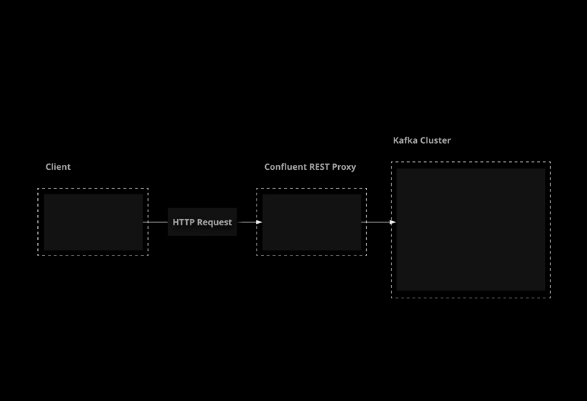

# Working with the Confluent Kafka REST APIs

## The Confluent REST Proxy



Confluent offers even more ways to interact with Kafka. One of these is Confluent REST Proxy,
a RESTful interface built on top of Kafka. In this lesson, we will briefly introduce Confluent REST Proxy.
We will also demonstrate how to get Confluent REST Proxy running in our Kafka cluster.

The **Confluent REST Proxy** provdes a "RESTful interface" for Kafka. It is part of Confluent and does not come with a standard non-Confluent Kafka installation.

**REpresentational State Transfer (REST)**
An architectural style for creating web services that uses normal HTTP patterns as a standard for interacting with web resources.

The Confluent REST Proxy allows you to interact with Kafka using simple HTTP requests.

References:

- [Confluent REST Proxy]
- [Confluent REST Proxy API Reference]

1. Start the confluent-schema-registry and confluent-kafka-rest services on your large broker.

    ```sh
    sudo systemctl start confluent-schema-registry confluent-kafka-rest
    sudo systemctl enable confluent-schema-registry confluent-kafka-rest
    ```

2. Verify that the services are running.

    ```sh
    sudo systemctl status confluent-schema-registry confluent-kafka-rest
    ```

## Producing Messages with REST Proxy

The Confluent REST Proxy provides an additional method for publishing messages to Kafka. This can be particularly useful for
simple scripts or applications that do not have Kafka client libraries available. In this lesson, we will discuss the process of
producing messages via the Confluent REST Proxy. We will also demonstrate how to produce messages to a topic using a
simple HTTP request.

To reduce messages with REST, send a POST request to:

`http://localhost:8082/topics/<topic_name>`

For the POST body, ener a JSON representation of the message(s) you want to publish:

```json
{
    "records":[
        {
            "key": "<key>",
            "value": "<value>"
        },
        {
            "key": "<key>",
            "value": "<value>"
        }
    ]
}
```

References:

- [REST Proxy Quick Start](https://docs.confluent.io/platform/current/kafka-rest/quickstart.html)
- [Confluent REST Proxy API Reference](https://docs.confluent.io/platform/current/kafka-rest/api.html)

1. Create a topic to use for testing.

    ```sh
    kafka-topics
        --bootstrap-server localhost:9092
        --create
        --topic rest-test-topic
        --partitions 1
        --replication-factor 1
    ```

1. Publish some messages to the topic using the Confluent REST proxy.

    ```sh
    curl -X POST \
        -H "Content-Type: application/vnd.kafka.json.v2+json" \
        -H "Accept: application/vnd.kafka.v2+json" \
        --data '{
            "records":[
                {"key": "message", "value": "Hello"},
                {"key": "message", "value": "World"}
            ]
        }' \
        http://localhost:8082/topics/rest-test-topic
    ```

1. You should get a response containing metadata about the two new messages.
1. Use a console consumer to verify that your messages are present in the topic.

    ```sh
    kafka-console-consumer
        --bootstrap-server localhost:9092
        --topic rest-test-topic
        --from-beginning
        --property print.key=true
    ```

## Consuming Messages with REST Proxy

The Confluent REST Proxy makes it easy to produce messages using HTTP, but it also allows you to consume messages via
REST. In this lesson, we will discuss and demonstrate the process of consuming messages from a Kafka topic using the
Confluent REST Proxy.

References:

- [REST Proxy Quick Start](https://docs.confluent.io/platform/current/kafka-rest/quickstart.html)
- [Confluent REST Proxy API Reference](https://docs.confluent.io/platform/current/kafka-rest/api.html)

1. Create a consumer and a consumer instance that will start from the beginning of the topic log.

    ```sh
    curl -X POST \
        -H "Content-Type: application/vnd.kafka.v2+json" \
        --data '{
            "name": "my_consumer_instance",
            "format": "json",
            "auto.offset.reset": "earliest"
        }' \
        http://localhost:8082/consumers/my_json_consumer
    ```

1. Subscribe the consumer to the topic.

    ```sh
    curl -X POST \
        -H "Content-Type: application/vnd.kafka.v2+json" \
        --data '{
            "topics": ["rest-test-topic"]
        }' \
        http://localhost:8082/consumers/my_json_consumer/instances/my_consumer_instance/subscription
    ```

1. Consume the messages.

    ```sh
    curl -X GET \
        -H "Accept: application/vnd.kafka.json.v2+json" \
        http://localhost:8082/consumers/my_json_consumer/instances/my_consumer_instance/records
    ```

1. When you are finished using the consumer, close it to clean up.

    ```sh
    curl -X DELETE \
        -H "Content-Type: application/vnd.kafka.v2+json" \
        http://localhost:8082/consumers/my_json_consumer/instances/my_consumer_instance
    ```

## [Hands-On] Producing Kafka Messages with Confluent REST Proxy

Your supermarket company is using Kafka to handle messaging as part of its infrastructure.
Recently, some data was lost before it could be published to Kafka due to a power failure in a data center.
You have been asked to publish these lost records to the necessary topics manually. Luckily, Confluent REST
Proxy is installed and can be used to interact with Kafka using simple HTTP requests easily.

Using Confluent REST Proxy, publish the following records to the Kafka cluster.

Publish to the `inventory_purchases` topic:

- Key: `apples`, Value: `23`
- Key: `grapes`, Value: `160`

Publish to the `member_signups` topic:

- Key: `77543`, Value: `Rosenberg, Willow`
- Key: `56878`, Value: `Giles, Rupert`

If you get stuck, feel free to check out the solution video, or the detailed instructions under each objective. Good luck!

**Publish the Missing Records to the `inventory_purchases` Topic**

1. Publish the records using an HTTP request to Confluent REST Proxy:

    ```sh
    curl -X POST \
        -H "Content-Type: application/vnd.kafka.json.v2+json" \
        -H "Accept: application/vnd.kafka.v2+json" \
        --data '{"records":[{"key":"apples","value":"23"},{"key":"grapes","value":"160"}]}' \
        http://localhost:8082/topics/inventory_purchases
    ```

1. We can verify that the data is in the topic with a console consumer:

    ```sh
    kafka-console-consumer \
        --bootstrap-server localhost:9092 \
        --topic inventory_purchases \
        --from-beginning \
        --property print.key=true
    ```

    > Note: We should see the processed total of 2 messages.

1. Publish the Missing Records to the member_signups Topic
1. Publish the records using an HTTP request to Confluent REST Proxy:

    ```sh
    curl -X POST \
        -H "Content-Type: application/vnd.kafka.json.v2+json" \
        -H "Accept: application/vnd.kafka.v2+json" \
        --data '{"records":[{"key":"77543","value":"Rosenberg, Willow"},{"key":"56878","value":"Giles, Rupert"}]}' \
        http://localhost:8082/topics/member_signups
    ```

1. We can verify that the data is in the topic with a console consumer:

    ```sh
    kafka-console-consumer \
        --bootstrap-server localhost:9092 \
        --topic member_signups \
        --from-beginning \
        --property print.key=true
    ```

    > Note: We should see the processed total of 2 messages.

## [hands-On] Consuming Kafka Messages with Confluent REST Proxy

Your supermarket company is using Kafka to handle messaging as part of its infrastructure. They want to
prepare a report that requires some data that is currently stored in Kafka.

You have been asked to access the cluster and provide some data points that will be used in this report.
Luckily, the Confluent REST Proxy will make it easy for you to gather the necessary data using simple HTTP requests.
Obtain the requested data points and place them in the specified output files.

First, the report will need to include the number of apples sold in the last week. This information can be
found in a topic called `weekly_sales`. The records in this topic represent aggregate data. Find the latest
record with a key of `apples` and write its value to the file located at `/home/cloud_user/output/apple_sales.txt`.

Secondly, the report needs to include the current quarterly balance for product purchases.
Read from the topic called quarterly_purchases. Find the latest record and write its value to the file
located at `/home/cloud_user/output/quarterly_balance.txt`.

If you get stuck, feel free to check out the solution video, or the detailed instructions under each objective.
Good luck!

### Provide the Number of Apples Sold in the Last Week

1. Create a new consumer and consumer_instance:

    ```sh
    curl -X POST \
        -H "Content-Type: application/vnd.kafka.v2+json" \
        --data '{"name": "sales_consumer_instance", "format": "json", "auto.offset.reset": "earliest"}' \
        http://localhost:8082/consumers/sales_json_consumer
    ```

1. Subscribe the consumer to the weekly_sales topic:

    ```sh
    curl -X POST \
        -H "Content-Type: application/vnd.kafka.v2+json" \
        --data '{"topics":["weekly_sales"]}' \
        http://localhost:8082/consumers/sales_json_consumer/instances/sales_consumer_instance/subscription
    ```

1. Consume the messages:

    ```sh
    curl -X GET \
        -H "Accept: application/vnd.kafka.json.v2+json" \
        http://localhost:8082/consumers/sales_json_consumer/instances/sales_consumer_instance/records
    ```

1. Locate the latest record with a key of apples and copy its value.
1. Edit the output file:

    ```sh
    vi /home/cloud_user/output/apple_sales.txt
    ```

1. Paste in the value from the latest apples record and save the file.

### Provide the Current Quarterly Balance for Product Purchases

1. Create a new consumer and consumer_instance:

    ```sh
    curl -X POST \
        -H "Content-Type: application/vnd.kafka.v2+json" \
        --data '{"name": "balance_consumer_instance", "format": "json", "auto.offset.reset": "earliest"}' \
        http://localhost:8082/consumers/balance_json_consumer
    ```

1. Subscribe the consumer to the quarterly_purchases topic:

    ```sh
    curl -X POST \
        -H "Content-Type: application/vnd.kafka.v2+json" \
        --data '{"topics":["quarterly_purchases"]}' \
        http://localhost:8082/consumers/balance_json_consumer/instances/balance_consumer_instance/subscription
    ```

1. Consume the messages:

    ```sh
    curl -X GET \
        -H "Accept: application/vnd.kafka.json.v2+json" \
        http://localhost:8082/consumers/balance_json_consumer/instances/balance_consumer_instance/records
    ```

1. Locate the latest record and copy its value.
1. Edit the output file:

    ```sh
    vi /home/cloud_user/output/quarterly_balance.txt
    ```

1. Paste in the value from the latest record and save the file.
