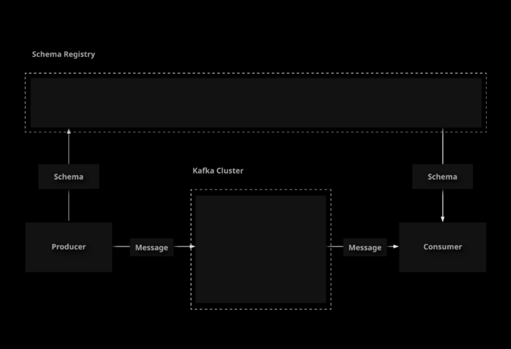
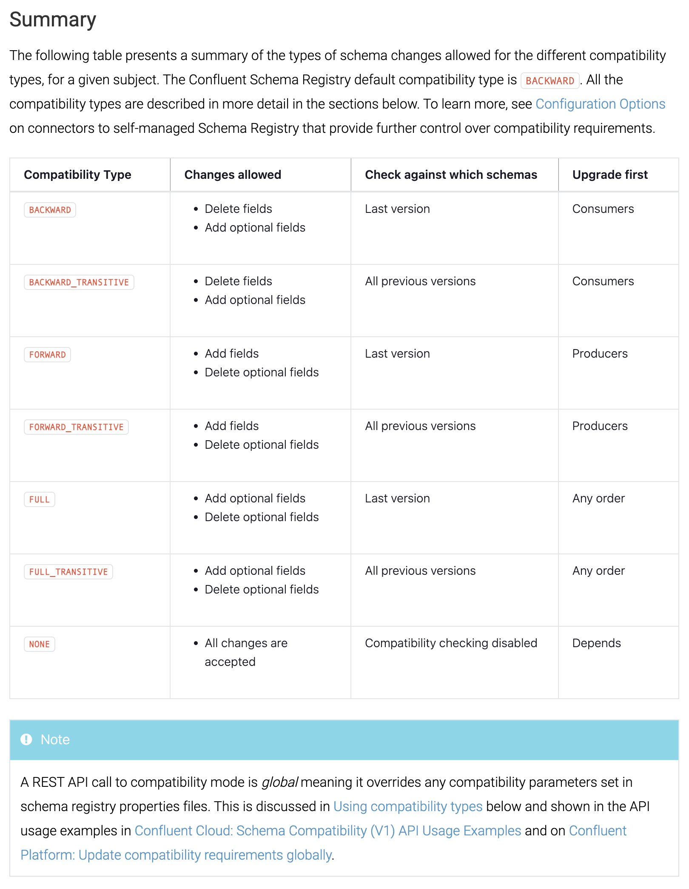

# Confluent Schema Registry

## What Is Confluent Schema Registry?

Confluent Schema Registry provides powerful functionality for maintaining and evolving contracts regarding data format
between your producers and consumers. In this lesson, we will introduce Confluent Schema Registry and provide a high-level
overview of what it does. This will prepare you to work with Schema Registry in the following lessons.



**Confluent Schema Registry** is a versioned, distributed storage for **Apache Avro** schemas.

These schemas define an expected format for your data and can be used to serialize and deserialize complex data formats when interacting with Kafka.

Avro schemas allow producers to specify a complex format for published data, and consumers can use the schema to interpret this data.
Both communicate with the schma registry to store and retrieve these schemas.

Schemas can be applied to both `keys` ang `values` in messages.

References:

- [Schema Management](https://docs.confluent.io/platform/current/schema-registry/index.html)

1. Make sure Confluent Schema Registry is running.

    ```sh
    sudo systemctl status confluent-schema-registry
    ```

1. If you haven't started Schema Registry yet, you can do so like this:

    ```sh
    sudo systemctl start confluent-schema-registry
    sudo systemctl enable confluent-schema-registry
    ```

## Creating an Avro Schema

Avro schemas allow you to define your own custom data formats with multiple fields. You can then use these formats to
serialize and deserialize Kafka records. In this lesson, we will create a simple Avro schema definition file in a Java project.

Avro schemas are represented in JSON.

```json
{
    "namespace": "<namespace>",
    "type": "record",
    "name": "<schema_name>",
    "fields": [
        {
            "name": "<field_name>",
            "type": "<field_type>"
        }
    ]
}
```

References:

- [Schema Registry Tutorial](https://docs.confluent.io/platform/current/schema-registry/schema_registry_onprem_tutorial.html)
- [Apache Avro](https://avro.apache.org/docs/1.11.1/specification/_print/)

1. Clone the starter project.

    ```sh
    cd ~/
    git clone https://github.com/linuxacademy/content-ccdak-schema-registry.git
    ```

1. Create a schema definition file.

    ```sh
    cd content-ccdak-schema-registry
    mkdir -p src/main/avro/com/linuxacademy/ccdak/schemaregistry
    vi src/main/avro/com/linuxacademy/ccdak/schemaregistry/Person.avsc
    ```

1. Implement a schema definition for data representing a person.

    ```json
    {
        "namespace": "com.linuxacademy.ccdak.schemaregistry",
        "type": "record",
        "name": "Person",
        "fields": [
            {"name": "id", "type": "int"},
            {"name": "first_name", "type": "string"},
            {"name": "last_name", "type": "string"},
            {"name": "email", "type": "string"}
        ]
    }
    ```

## Using Schema Registry with a Kafka Producer

With Confluent Schema Registry, Kafka producers can register a schema with the registry and then use that schema to convert
a Java object into data that can be published to a topic. In this lesson, we will demonstrate the process of building a Kafka
producer in Java that uses Confluent Schema Registry to serialize and publish data.

To build a Kafka producer that uses Schema Registry, we need to perform the following steps:

1. Add the Avro plugin to the project.
1. Add the Confluent Maven repository to the project.
1. Add the Schema Registry and Avro dependencies to the project.
1. Implement a producer that is set up to use an avro Serializer.
1. Publish some records using the auto-generated Avro Java object.

References:

- [Schema Registry Tutorial](https://docs.confluent.io/platform/current/schema-registry/schema_registry_onprem_tutorial.html)
- [GitHub Producer Example](https://github.com/confluentinc/examples/blob/5.3.0-post/clients/avro/src/main/java/io/confluent/examples/clients/basicavro/ProducerExample.java)

1. Clone the starter project if you have not already done so

    ```sh
    cd ~/
    git clone https://github.com/linuxacademy/content-ccdak-schema-registry.git
    ```

1. Edit `build.gradle`

    ```sh
    cd content-ccdak-schema-registry
    vi build.gradle
    ```

1. Add the Confluent repository, Avro plugin, and Avro dependencies.

    ```gradle
    plugins {
        id 'application'
        id 'com.commercehub.gradle.plugin.avro' version '0.9.1'
    }

    repositories {
        mavenCentral()
        maven { url 'https://packages.confluent.io/maven' }
    }

    dependencies {
        implementation 'org.apache.kafka:kafka-clients:2.2.1'
        implementation 'io.confluent:kafka-avro-serializer:5.3.0'
        implementation 'org.apache.avro:avro:1.9.0'
        testImplementation 'junit:junit:4.12'
    }
    ...
    ```

1. Edit the `ProducerMain` class.

    ```sh
    vi src/main/java/com/linuxacademy/ccdak/schemaregistry/SchemaRegistryProducerMain.java
    ```

1. Implement a producer that serializes data using an Avro schema. This class uses the `Person` schema
created in an earlier lesson at `src/main/avro/com/linuxacademy/ccdak/schemaregistry/Person.avsc`

    ```java
    package com.linuxacademy.ccdak.schemaregistry;

    import io.confluent.kafka.serializers.AbstractKafkaAvroSerDeConfig;
    import io.confluent.kafka.serializers.KafkaAvroSerializer;
    import java.util.Properties;
    import org.apache.kafka.clients.producer.KafkaProducer;
    import org.apache.kafka.clients.producer.ProducerConfig;
    import org.apache.kafka.clients.producer.ProducerRecord;
    import org.apache.kafka.common.serialization.StringSerializer;

    public class SchemaRegistryProducerMain {

        public static void main(String[] args) {
            final Properties props = new Properties();
            props.put(ProducerConfig.BOOTSTRAP_SERVERS_CONFIG, "localhost:9092");
            props.put(ProducerConfig.ACKS_CONFIG, "all");
            props.put(ProducerConfig.RETRIES_CONFIG, 0);
            props.put(ProducerConfig.KEY_SERIALIZER_CLASS_CONFIG, StringSerializer.class);
            props.put(ProducerConfig.VALUE_SERIALIZER_CLASS_CONFIG, KafkaAvroSerializer.class);
            props.put(AbstractKafkaAvroSerDeConfig.SCHEMA_REGISTRY_URL_CONFIG, "http://localhost:8081");

            /*
            NOTE:
            Person class are automatically generated by Avro plugin, that we added in build.gradle, so that
            Avro plugin is going to look inside that src/main directory and it's gonna find our schema definition
            file that we created
            */
            KafkaProducer<String, Person> producer = new KafkaProducer<String, Person>(props);

            Person kenny = new Person(125745, "Kenny", "Armstrong", "kenny@linuxacademy.com");
            producer.send(new ProducerRecord<String, Person>("employees", kenny.getId().toString(), kenny));

            Person terry = new Person(943256, "Terry", "Cox", "terry@linuxacademy.com");
            producer.send(new ProducerRecord<String, Person>("employees", terry.getId().toString(), terry));

            producer.close();
        }

    }
    ```

1. Create the employees topic to use for testing.

    ```sh
    kafka-topics \
        --bootstrap-server localhost:9092 \
        --create \
        --topic employees \
        --partitions 1 \
        --replication-factor 1
    ```

1. Run your code.

    ```sh
    ./gradlew runProducer
    ```

1. Verify that the messages published by the producer are present in the topic.

    ```sh
    kafka-console-consumer \
        --bootstrap-server localhost:9092 \
        --topic employees \
        --from-beginning
    ```

1. Note that the data will not display correctly since the console consumer's default string deserializer is not set up to
correctly interpret the serialized data. However, you can still use the console consumer to verify that the data is present.

## Using Schema Registry With a Kafka Consumer

When a producer uses Confluent Schema Registry and publishes data to a topic, consumers can use Schema Registry to
download the schema and properly deserialize the data. In this lesson, we will build a consumer in Java that interacts with
Confluent Schema Registry in order to deserialize Kafka data into a Java object.

To build a Kafka consumer that uses Schema Registry, we need to perform the following steps:

1. Implement a consumer that is set up to use an Avro deserializer.
1. Consume the records and use them to populate the auto-generated Avro Java object.

References:

- [Schema Registry Tutorial](https://docs.confluent.io/platform/current/schema-registry/schema_registry_onprem_tutorial.html)
- [GitHub Consumer Example](https://github.com/confluentinc/examples/blob/5.3.0-post/clients/avro/src/main/java/io/confluent/examples/clients/basicavro/ConsumerExample.java)

1. Clone the starter project if you have not already done so.

    ```sh
    cd ~/
    git clone https://github.com/linuxacademy/content-ccdak-schema-registry.git
    ```

1. Edit the Consumer Main class.

    ```sh
    cd content-ccdak-schema-registry
    vi src/main/java/com/linuxacademy/ccdak/schemaregistry/SchemaRegistryConsumerMain.java
    ```

1. Implement a consumer that deserializes data using an avro schema. This class uses the `Person` schema created in an earlier
lesson at `src/main/avro/com/linuxacademy/ccdak/schemaregistry/Person.avsc`

    ```java
    package com.linuxacademy.ccdak.schemaregistry;

    import io.confluent.kafka.serializers.AbstractKafkaAvroSerDeConfig;
    import io.confluent.kafka.serializers.KafkaAvroDeserializer;
    import io.confluent.kafka.serializers.KafkaAvroDeserializerConfig;
    import java.time.Duration;
    import java.util.Collections;
    import java.util.Properties;
    import org.apache.kafka.clients.consumer.ConsumerConfig;
    import org.apache.kafka.clients.consumer.ConsumerRecord;
    import org.apache.kafka.clients.consumer.ConsumerRecords;
    import org.apache.kafka.clients.consumer.KafkaConsumer;
    import org.apache.kafka.common.serialization.StringDeserializer;

    public class SchemaRegistryConsumerMain {

        public static void main(String[] args) {
            final Properties props = new Properties();
            props.put(ConsumerConfig.BOOTSTRAP_SERVERS_CONFIG, "localhost:9092");
            props.put(ConsumerConfig.GROUP_ID_CONFIG, "group1");
            props.put(ConsumerConfig.ENABLE_AUTO_COMMIT_CONFIG, "true");
            props.put(ConsumerConfig.AUTO_COMMIT_INTERVAL_MS_CONFIG, "1000");
            props.put(ConsumerConfig.AUTO_OFFSET_RESET_CONFIG, "earliest");
            props.put(AbstractKafkaAvroSerDeConfig.SCHEMA_REGISTRY_URL_CONFIG, "http://localhost:8081");
            props.put(ConsumerConfig.KEY_DESERIALIZER_CLASS_CONFIG, StringDeserializer.class);
            props.put(ConsumerConfig.VALUE_DESERIALIZER_CLASS_CONFIG, KafkaAvroDeserializer.class);
            props.put(KafkaAvroDeserializerConfig.SPECIFIC_AVRO_READER_CONFIG, true);

            KafkaConsumer<String, Person> consumer = new KafkaConsumer<>(props);
            consumer.subscribe(Collections.singletonList("employees"));

            while (true) {
                final ConsumerRecords<String, Person> records = consumer.poll(Duration.ofMillis(100));
                for (final ConsumerRecord<String, Person> record : records) {
                    final String key = record.key();
                    final Person value = record.value();
                    System.out.println("key=" + key + ", value=" + value);
                }
            }
        }

    }
    ```

1. Run your code.

    ```sh
    ./gradlew runConsumer
    ```

1. You should see the data created earlier by the producer printed to the screen

## Managing Changes to an Avro Schema

Confluent Schema Registry makes it easy to serialize and deserialize complex data structures and to ensure that both
producers and consumers have access to schemas. It also provides functionality to help you manage changes to your
schemas. In this lesson, we will discuss the compatibility checking features Schema Registry provides, and we will demonstrate
how they can help you roll out changes to your schemas that affect both producers and consumers.

When developing and application, you may sometimes need to make changes to your schema.

This creates a problem because there may be messages in your topic(s) that were serialized using the old schema.
**How will consumers be able to deserialize them once the schema has changed?**

Confluent Schema Registry implements a **schema compatibility checking** mechanism to help you evolve your schemas
over time.

Here's how schema compatibility checking works:

- Select a compatibility type for your schema.
- Schema Registry will prevent you from making changes that would break compatibility based on your chosen compatibility type.
- If a producer attempts to register an incompatible schema, an error will occur.

Compatibility types:

- **BACKWARD** _(Default)_
    Consumers using an updated schema can read data that was serialized via the current schema in the registry.
- **BACKWARD_TRANSITIVE**
    A consumer using an updated schema can use data serialized via all previously registered schemas.
- **FORWARD**
    Consumers using the current schema in the registry can read data serialized via the updated schema.
- **FORWARD_TRANSITIVE**
    Consumers using any previous schema in the registry can read data serialized via the updated schema.
- **FULL**
    The new schema is forward and backward compatible with the current schema in the registry.
- **FULL_TRANSITIVE**
    The new schema is forward and backward compatible with all previous schemas in the registry.
- **NONE**
    All compatibility checks are disabled.



References:

- [Schema Evolution and Compatibility Summary](https://docs.confluent.io/current/schema-registry/avro.html)
- [Schema Evolution and Compatibility Tutorial](https://docs.confluent.io/platform/current/schema-registry/schema_registry_onprem_tutorial.html#schema-evolution-and-compatibility)

1. Run the producer to produce some messages using the current schema, then run the consumer to view them.

    ```sh
    cd ~/content-ccdak-schema-registry
    ./gradlew runProducer
    ./gradlew runConsumer
    ```

1. Edit the Person schema.

    ```sh
    vi src/main/avro/com/linuxacademy/ccdak/schemaregistry/Person.avsc
    ```

1. Add a new field to the schema.

    ```json
    {
        "namespace": "com.linuxacademy.ccdak.schemaregistry",
        "compatibility": "BACKWARD",
        "type": "record",
        "name": "Person",
        "fields": [
            {"name": "id", "type": "int"},
            {"name": "first_name", "type": "string"},
            {"name": "last_name", "type": "string"},
            {"name": "email", "type": "string"},
            {"name": "twitter", "type": "string"}
        ]
    }
    ```

1. Edit the producer.

    ```sh
    vi src/main/java/com/linuxacademy/ccdak/schemaregistry/SchemaRegistryProducerMain.java
    ```

1. Set the new Twitter handle field for the records being published.

    ```java
    ...
    Person kenny = new Person(125745, "Kenny", "Armstrong", "kenny@linuxacademy.com", "@kenny");
    producer.send(new ProducerRecord<String, Person>("employees", kenny.getId().toString(), kenny));
    Person terry = new Person(943256, "Terry", "Cox", "terry@linuxacademy.com", "@terry");
    producer.send(new ProducerRecord<String, Person>("employees", terry.getId().toString(), terry));
    ...
    ```

1. Run the producer.

    ```sh
    ./gradlew runProducer
    ```

1. Because this schema uses the default compatibility type of BACKWARD , this change will not be allowed.
Therefore, you should get an error message when running the producer.
1. Edit the schema again.

    ```sh
    vi src/main/avro/com/linuxacademy/ccdak/schemaregistry/Person.avsc
    ```

1. Add a default value to the Twitter field. This will make the new schema backwards-compatible with the old schema.

    ```json
    {
        "namespace": "com.linuxacademy.ccdak.schemaregistry",
        "compatibility": "BACKWARD",
        "type": "record",
        "name": "Person",
        "fields": [
            {"name": "id", "type": "int"},
            {"name": "first_name", "type": "string"},
            {"name": "last_name", "type": "string"},
            {"name": "email", "type": "string"},
            {"name": "twitter", "type": "string", "default": ""}
        ]
    }
    ```

1. Run the producer again.

    ```sh
    ./gradlew runProducer
    ```

1. Run the consumer again.

    ```sh
    ./gradlew runConsumer
    ```

1. This time, the producer should be able to run successfully.

## [Hands-On] Using Schema Registry in a Kafka Application

Your supermarket company is using Kafka to manage updates to inventory as purchases are made in real-time.
In the past, data was published to a topic in a basic format, but the company now wants to use a more
complex data structure with multiple data points in each record. This is a good use case for
Confluent Schema Registry. Create a schema to represent the data and then build a simple producer to
publish some sample data using the schema. Finally, create a consumer to consume this data and output it to a data file.

There is a starter project on GitHub at [https://github.com/linuxacademy/content-ccdak-schema-registry-lab](https://github.com/linuxacademy/content-ccdak-schema-registry-lab). Clone this project to the broker and edit its files to implement the solution.

Use the following specification to build a schema called `Purchase`.
You can place the schema file in `src/main/avro/com/linuxacademy/ccdak/schemaregistry/`.

- Field `id` with type `int`. This will contain the purchase `id`.
- Field `product` with type `string`. This will contain the name of the product purchased.
- Field `quantity` with type `int`. This will contain the quantity of the product purchased.

Create a publisher that publishes some sample records using this schema to the `inventory_purchases` topic.

Then, create a consumer to read these records and output them to a file located at `/home/cloud_user/output/output.txt`.

You can run the producer in the starter project with the command `./gradlew runProducer`.
The consumer can be run with `./gradlew runConsumer`. Run both the producer and consumer to verify that everything works.

If you get stuck, feel free to check out the solution video, or the detailed instructions under each objective. Good luck!

### Clone the Starter Project and Run It to Make Sure Everything Is Working

1. Clone the starter project into your home directory:

    ```sh
    cd ~/
    git clone https://github.com/linuxacademy/content-ccdak-schema-registry-lab.git
    ```

1. Verify that the `content-ccdak-schema-registry-lab` output directory was created with:

    ```sh
    ls
    ```

1. Run the code to ensure it works before modifying it:

    ```sh
    cd content-ccdak-schema-registry-lab/
    ./gradlew runProducer
    ./gradlew runConsumer
    ```

    > Note: We should see a `Hello, world!` message in the output for both the producer and the consumer.

### Implement the Producer and Consumer Using an Avro Schema

1. Create the directory for Avro schemas:

    ```sh
    mkdir -p src/main/avro/com/linuxacademy/ccdak/schemaregistry
    ```

1. Create a schema definition for purchases:

    ```sh
    vi src/main/avro/com/linuxacademy/ccdak/schemaregistry/Purchase.avsc
    ```

    ```sh
    {
    "namespace": "com.linuxacademy.ccdak.schemaregistry",
    "type": "record",
    "name": "Purchase",
    "fields": [
        {"name": "id", "type": "int"},
        {"name": "product", "type": "string"},
        {"name": "quantity", "type": "int"}
    ]
    }
    ```

1 .Implement the producer:

    ```sh
    vi src/main/java/com/linuxacademy/ccdak/schemaregistry/ProducerMain.java
    ```

    ```java
    import io.confluent.kafka.serializers.AbstractKafkaAvroSerDeConfig;
    import io.confluent.kafka.serializers.KafkaAvroSerializer;
    import java.util.Properties;
    import org.apache.kafka.clients.producer.KafkaProducer;
    import org.apache.kafka.clients.producer.ProducerConfig;
    import org.apache.kafka.clients.producer.ProducerRecord;
    import org.apache.kafka.common.serialization.StringSerializer;

    public class ProducerMain {

        public static void main(String[] args) {
            final Properties props = new Properties();
            props.put(ProducerConfig.BOOTSTRAP_SERVERS_CONFIG, "localhost:9092");
            props.put(ProducerConfig.ACKS_CONFIG, "all");
            props.put(ProducerConfig.RETRIES_CONFIG, 0);
            props.put(ProducerConfig.KEY_SERIALIZER_CLASS_CONFIG, StringSerializer.class);
            props.put(ProducerConfig.VALUE_SERIALIZER_CLASS_CONFIG, KafkaAvroSerializer.class);
            props.put(AbstractKafkaAvroSerDeConfig.SCHEMA_REGISTRY_URL_CONFIG, "http://localhost:8081");

            KafkaProducer<String, Purchase> producer = new KafkaProducer<String, Purchase>(props);

            Purchase apples = new Purchase(1, "apples", 17);
            producer.send(new ProducerRecord<String, Purchase>("inventory_purchases", apples.getId().toString(), apples));

            Purchase oranges = new Purchase(2, "oranges", 5);
            producer.send(new ProducerRecord<String, Purchase>("inventory_purchases", oranges.getId().toString(), oranges));

            producer.close();
        }

    }
    ```

1. Save and exit.
1. Implement the consumer:

    ```sh
    vi src/main/java/com/linuxacademy/ccdak/schemaregistry/ConsumerMain.java
    ```

    ```java
    package com.linuxacademy.ccdak.schemaregistry;

    import io.confluent.kafka.serializers.AbstractKafkaAvroSerDeConfig;
    import io.confluent.kafka.serializers.KafkaAvroDeserializer;
    import io.confluent.kafka.serializers.KafkaAvroDeserializerConfig;
    import java.io.BufferedWriter;
    import java.io.FileWriter;
    import java.io.IOException;
    import java.time.Duration;
    import java.util.Collections;
    import java.util.Properties;
    import org.apache.kafka.clients.consumer.ConsumerConfig;
    import org.apache.kafka.clients.consumer.ConsumerRecord;
    import org.apache.kafka.clients.consumer.ConsumerRecords;
    import org.apache.kafka.clients.consumer.KafkaConsumer;
    import org.apache.kafka.common.serialization.StringDeserializer;

    public class ConsumerMain {

        public static void main(String[] args) {
            final Properties props = new Properties();
            props.put(ConsumerConfig.BOOTSTRAP_SERVERS_CONFIG, "localhost:9092");
            props.put(ConsumerConfig.GROUP_ID_CONFIG, "group1");
            props.put(ConsumerConfig.ENABLE_AUTO_COMMIT_CONFIG, "true");
            props.put(ConsumerConfig.AUTO_COMMIT_INTERVAL_MS_CONFIG, "1000");
            props.put(ConsumerConfig.AUTO_OFFSET_RESET_CONFIG, "earliest");
            props.put(AbstractKafkaAvroSerDeConfig.SCHEMA_REGISTRY_URL_CONFIG, "http://localhost:8081");
            props.put(ConsumerConfig.KEY_DESERIALIZER_CLASS_CONFIG, StringDeserializer.class);
            props.put(ConsumerConfig.VALUE_DESERIALIZER_CLASS_CONFIG, KafkaAvroDeserializer.class);
            props.put(KafkaAvroDeserializerConfig.SPECIFIC_AVRO_READER_CONFIG, true);

            KafkaConsumer<String, Purchase> consumer = new KafkaConsumer<>(props);
            consumer.subscribe(Collections.singletonList("inventory_purchases"));

            try {
                BufferedWriter writer = new BufferedWriter(new FileWriter("/home/cloud_user/output/output.txt", true));
                while (true) {
                    final ConsumerRecords<String, Purchase> records = consumer.poll(Duration.ofMillis(100));
                    for (final ConsumerRecord<String, Purchase> record : records) {
                        final String key = record.key();
                        final Purchase value = record.value();
                        String outputString = "key=" + key + ", value=" + value;
                        System.out.println(outputString);
                        writer.write(outputString + "\n");
                    }
                    writer.flush();
                }
            } catch (IOException e) {
                throw new RuntimeException(e);
            }
        }

    }
    ```

1. Save and exit.
1. Run the producer:

    ```sh
    ./gradlew runProducer
    ```

    > Note: We should see a `BUILD SUCCESSFUL` message, and no errors should be present.
1. Run the consumer:

    ```sh
    ./gradlew runConsumer
    ```

    > Note: We should see an `EXECUTING` message alongside of the producer data, and no errors should be present.

1. Verify the data in the output file:

    ```sh
    cat /home/cloud_user/output/output.txt
    ```

    > Note: We should see our records displayed.

## [Hands-On] Evolving an Avro Schema in a Kafka Application

Your supermarket company is using Kafka to track changes in inventory as purchases occur. There is a topic
for this data called `inventory_purchases`, plus a producer and consumer that interact with that topic.
The producer and consumer are using an Avro schema to serialize and deserialize the data.

The company has a membership program for customers, and members of the program each have a member ID.
The company would like to start tracking this member ID with the data in `inventory_purchases`.
This field should be optional, however, since not all customers participate in the membership program.

Add a new field called `member_id` to the `Purchase` schema. Make this field optional with a 0 default.
Then, update the producer to set this new field on the records it is producing. Run the producer and
consumer to verify that everything works.

The consumer writes its output to a data file located at `/home/cloud_user/output/output.txt`.
Once all changes are made, and everything is working, you should see the member_id field reflected in the data written to that file.

There is a starter project on GitHub at [https://github.com/linuxacademy/content-ccdak-schema-evolve-lab.git](https://github.com/linuxacademy/content-ccdak-schema-evolve-lab.git).
Clone this project to the broker and edit its files to implement the solution.

If you get stuck, feel free to check out the solution video, or the detailed instructions under each objective.
Good luck!

### Clone the Starter Project and Run It to Make Sure Everything Is Working

1. Clone the starter project into your home directory:

    ```sh
    cd ~/
    git clone https://github.com/linuxacademy/content-ccdak-schema-evolve-lab.git
    ```

1. Verify the content-ccdak-schema-evolve-lab output directory is created with:

    ```sh
    ls
    ```

1. Run the code to ensure it works before modifying it:

    ```sh
    cd content-ccdak-schema-evolve-lab/
    ./gradlew runProducer
    ./gradlew runConsumer
    ```

    > Note: The consumer should output some records that were created by the producer.

### Update the Purchase Schema to Add the `member_id` Field

1. Edit the schema definition file:

    ```sh
    vi src/main/avro/com/linuxacademy/ccdak/schemaregistry/Purchase.avsc
    ```

1. Add the `member_id` field with a blank default:

    ```json
    {
        "namespace": "com.linuxacademy.ccdak.schemaregistry",
        "compatibility": "FORWARD",
        "type": "record",
        "name": "Purchase",
        "fields": [
            {"name": "id", "type": "int"},
            {"name": "product", "type": "string"},
            {"name": "quantity", "type": "int"},
            {"name": "member_id", "type": "int", "default": 0}
        ]
    }
    ```

1. Save and exit.

### Update the Producer to Set the `member_id` for the Records It Publishes

1. Edit the producer `Main` class:

    ```sh
    vi src/main/java/com/linuxacademy/ccdak/schemaregistry/ProducerMain.java
    ```

1. Implement the new `member_id` field in the producer by setting it for the records being produced:

    ```java
    package com.linuxacademy.ccdak.schemaregistry;

    import io.confluent.kafka.serializers.AbstractKafkaAvroSerDeConfig;
    import io.confluent.kafka.serializers.KafkaAvroSerializer;
    import java.util.Properties;
    import org.apache.kafka.clients.producer.KafkaProducer;
    import org.apache.kafka.clients.producer.ProducerConfig;
    import org.apache.kafka.clients.producer.ProducerRecord;
    import org.apache.kafka.common.serialization.StringSerializer;

    public class ProducerMain {

        public static void main(String[] args) {
            final Properties props = new Properties();
            props.put(ProducerConfig.BOOTSTRAP_SERVERS_CONFIG, "localhost:9092");
            props.put(ProducerConfig.ACKS_CONFIG, "all");
            props.put(ProducerConfig.RETRIES_CONFIG, 0);
            props.put(ProducerConfig.KEY_SERIALIZER_CLASS_CONFIG, StringSerializer.class);
            props.put(ProducerConfig.VALUE_SERIALIZER_CLASS_CONFIG, KafkaAvroSerializer.class);
            props.put(AbstractKafkaAvroSerDeConfig.SCHEMA_REGISTRY_URL_CONFIG, "http://localhost:8081");

            KafkaProducer<String, Purchase> producer = new KafkaProducer<String, Purchase>(props);

            Purchase apples = new Purchase(1, "apples", 17, 77543);
            producer.send(new ProducerRecord<String, Purchase>("inventory_purchases", apples.getId().toString(), apples));

            Purchase oranges = new Purchase(2, "oranges", 5, 56878);
            producer.send(new ProducerRecord<String, Purchase>("inventory_purchases", oranges.getId().toString(), oranges));

            producer.close();
        }

    }
    ```

1. Save and exit.
1. Run the producer:

    ```sh
    ./gradlew runProducer
    ```

    > Note: We should see a `BUILD SUCCESSFUL` message, and no errors.

1. Run the consumer:

    ```sh
    ./gradlew runConsumer
    ```

    > Note: We should see an EXCECUTING message, and no errors.

1. Verify the data in the output file. We should see the new member_id data in the last lines of the file:

    ```sh
    cat /home/cloud_user/output/output.txt
    ```

    ```txt
    key=1, value={"id": 1, "product": "apples", "quantity": 17}
    key=2, value={"id": 2, "product": "oranges", "quantity": 5}
    key=1, value={"id": 1, "product": "apples", "quantity": 17, "member_id": 77543}
    key=2, value={"id": 2, "product": "oranges", "quantity": 5, "member_id": 56878}
    ```
